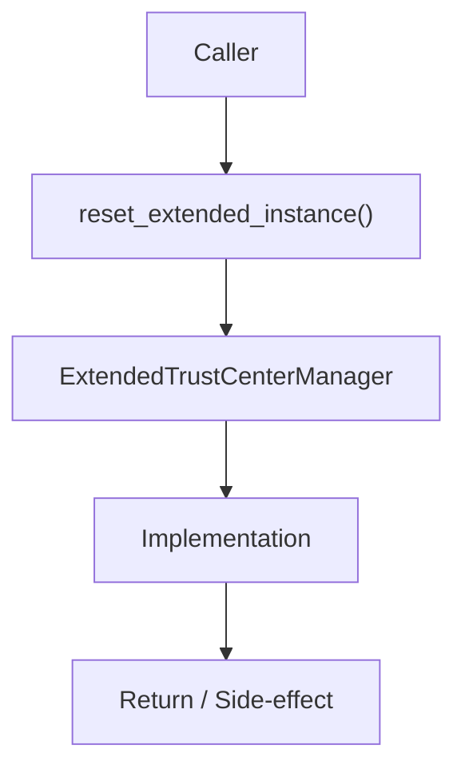

# Community 642 PRD — Extended Trust Center / Test Isolation

## Master Goal Mapping
- **ALDECI Domain**: Extended Trust Center / Test Isolation
- **Module**: `ExtendedTrustCenterManager`
- **Source**: `suite-core/core/trust_center.py:L1353`
- **Function/Method**: `reset_extended_instance`
- **Persona Alignment**: Security Engineer, Platform Operator
- **Strategic Goal**: Provide reliable, well-defined contract for `reset_extended_instance` within the Extended Trust Center / Test Isolation subsystem

## Architecture Diagram



## Code Proof

**File**: `suite-core/core/trust_center.py` — **Line**: `L1353`

**Signature**: `classmethod def reset_extended_instance(cls) -> None`

```python
@classmethod
def reset_extended_instance(cls) -> None:
    """Reset extended singleton (useful for tests)."""
    with cls._ext_lock:
        cls._ext_instance = None
```

## Inter-Dependencies

- `_ext_lock`
- `get_extended_instance`

## Data Flow

lock → _ext_instance = None → next get_extended_instance creates fresh

## Referenced Docs

- `docs/ALDECI_REARCHITECTURE_v2.md` — Architecture source of truth
- `suite-core/core/trust_center.py` — Full module implementation

## Acceptance Criteria

- [ ] Sets _ext_instance to None under lock
- [ ] Enables clean test isolation
- [ ] Does not affect base TrustCenterManager singleton

## Effort Estimate

**XS**

## Status

**Implemented**
