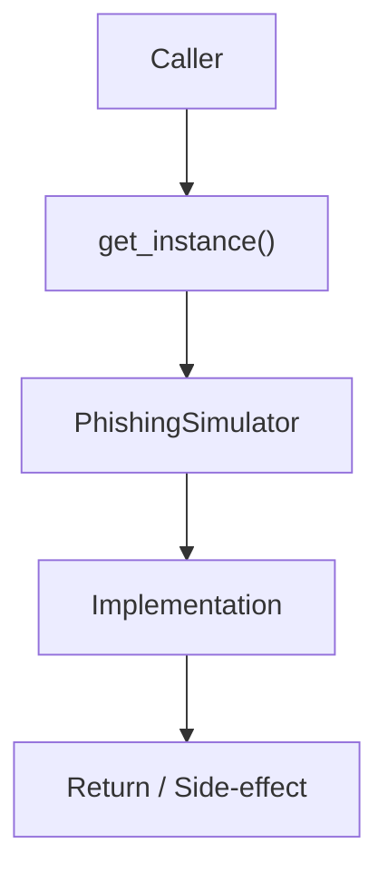

# Community 645 PRD — Phishing Simulation / Singleton

## Master Goal Mapping
- **ALDECI Domain**: Phishing Simulation / Singleton
- **Module**: `PhishingSimulator`
- **Source**: `suite-core/core/phishing_simulator.py:L745`
- **Function/Method**: `get_instance`
- **Persona Alignment**: Security Engineer, Platform Operator
- **Strategic Goal**: Provide reliable, well-defined contract for `get_instance` within the Phishing Simulation / Singleton subsystem

## Architecture Diagram



## Code Proof

**File**: `suite-core/core/phishing_simulator.py` — **Line**: `L745`

**Signature**: `classmethod def get_instance(cls) -> PhishingSimulator`

```python
@classmethod
def get_instance(cls) -> "PhishingSimulator":
    """Return the process-level singleton."""
    if not hasattr(cls, "_instance") or cls._instance is None:
        cls._instance = cls()
    return cls._instance
```

## Inter-Dependencies

- `PhishingSimulator.__init__`
- `phishing_simulation_router.py`

## Data Flow

no args → lazy init → PhishingSimulator singleton

## Referenced Docs

- `docs/ALDECI_REARCHITECTURE_v2.md` — Architecture source of truth
- `suite-core/core/phishing_simulator.py` — Full module implementation

## Acceptance Criteria

- [ ] Returns same instance across calls
- [ ] Initializes on first call
- [ ] Used by router endpoints

## Effort Estimate

**XS**

## Status

**Implemented**
