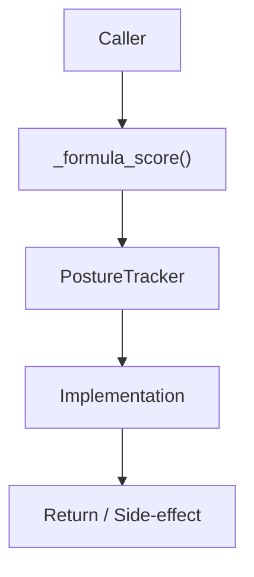

# Community 646 PRD — Security Posture Scoring

## Master Goal Mapping
- **ALDECI Domain**: Security Posture Scoring
- **Module**: `PostureTracker`
- **Source**: `suite-core/core/posture_tracker.py:L477`
- **Function/Method**: `_formula_score`
- **Persona Alignment**: Security Engineer, Platform Operator
- **Strategic Goal**: Provide reliable, well-defined contract for `_formula_score` within the Security Posture Scoring subsystem

## Architecture Diagram



## Code Proof

**File**: `suite-core/core/posture_tracker.py` — **Line**: `L477`

**Signature**: `staticmethod def _formula_score(critical, high, medium, low) -> float`

```python
"""Formula-based posture score.
Start at 100, deduct per finding:
  CRIT: -10, HIGH: -5, MED: -2, LOW: -0.5
Clamped to [0, 100].
"""
score = 100.0
score -= critical * 10.0
score -= high * 5.0
score -= medium * 2.0
score -= low * 0.5
return max(0.0, min(100.0, score))
```

## Inter-Dependencies

- `PostureTracker.compute_score()`
- `posture_score_engine.py`

## Data Flow

finding counts → weighted deduction → clamped float score

## Referenced Docs

- `docs/ALDECI_REARCHITECTURE_v2.md` — Architecture source of truth
- `suite-core/core/posture_tracker.py` — Full module implementation

## Acceptance Criteria

- [ ] Returns 100.0 with zero findings
- [ ] Returns 0.0 when deductions exceed 100
- [ ] Weights: CRIT=10, HIGH=5, MED=2, LOW=0.5
- [ ] Result clamped to [0, 100]

## Effort Estimate

**XS (pure function)**

## Status

**Implemented**
