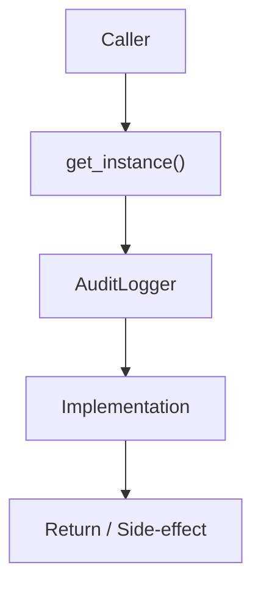

# Community 647 PRD — Audit Logging / Singleton

## Master Goal Mapping
- **ALDECI Domain**: Audit Logging / Singleton
- **Module**: `AuditLogger`
- **Source**: `suite-core/core/audit_log.py:L119`
- **Function/Method**: `get_instance`
- **Persona Alignment**: Security Engineer, Platform Operator
- **Strategic Goal**: Provide reliable, well-defined contract for `get_instance` within the Audit Logging / Singleton subsystem

## Architecture Diagram



## Code Proof

**File**: `suite-core/core/audit_log.py` — **Line**: `L119`

**Signature**: `classmethod def get_instance(cls, db_path='...') -> AuditLogger`

```python
@classmethod
def get_instance(cls, db_path=":memory:") -> AuditLogger:
    """Return the process-wide singleton, creating it if needed."""
    with cls._instance_lock:
        if cls._instance is None:
            cls._instance = cls(db_path)
        return cls._instance
```

## Inter-Dependencies

- `AuditLogger.__init__`
- `_instance_lock`
- `reset_instance (L127)`

## Data Flow

db_path → instance_lock → AuditLogger singleton with SQLite connection

## Referenced Docs

- `docs/ALDECI_REARCHITECTURE_v2.md` — Architecture source of truth
- `suite-core/core/audit_log.py` — Full module implementation

## Acceptance Criteria

- [ ] Thread-safe singleton creation
- [ ] Reuses existing instance on subsequent calls
- [ ] db_path used only on first creation

## Effort Estimate

**XS**

## Status

**Implemented**
