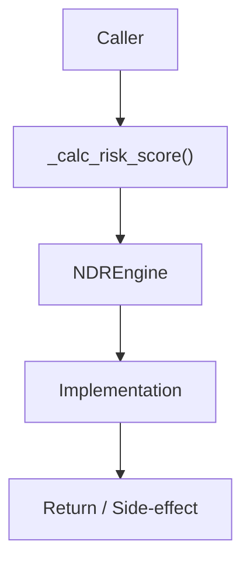

# Community 649 PRD — Network Detection & Response / Risk Scoring

## Master Goal Mapping
- **ALDECI Domain**: Network Detection & Response / Risk Scoring
- **Module**: `NDREngine`
- **Source**: `suite-core/core/ndr_engine.py:L146`
- **Function/Method**: `_calc_risk_score`
- **Persona Alignment**: Security Engineer, Platform Operator
- **Strategic Goal**: Provide reliable, well-defined contract for `_calc_risk_score` within the Network Detection & Response / Risk Scoring subsystem

## Architecture Diagram



## Code Proof

**File**: `suite-core/core/ndr_engine.py` — **Line**: `L146`

**Signature**: `staticmethod def _calc_risk_score(data: Dict) -> float`

```python
"""Calculate risk score from flow attributes (0.0 – 1.0)."""
score = 0.0
if dst_port in _HIGH_RISK_PORTS: score += 0.3
if bytes_sent > 1_000_000: score += 0.2
if flow_type == "external": score += 0.1
if protocol not in {"TCP","UDP","HTTPS","HTTP"}: score += 0.2
return min(round(score, 4), 1.0)
```

## Inter-Dependencies

- `_HIGH_RISK_PORTS constant`
- `NDREngine.ingest_flow()`
- `ndr_router.py`

## Data Flow

network flow dict → port/bytes/type/protocol checks → float score in [0, 1]

## Referenced Docs

- `docs/ALDECI_REARCHITECTURE_v2.md` — Architecture source of truth
- `suite-core/core/ndr_engine.py` — Full module implementation

## Acceptance Criteria

- [ ] Returns 0.0 for benign internal TCP flows
- [ ] Adds 0.3 for high-risk ports (22, 3389, etc.)
- [ ] Adds 0.2 for >1MB transfers
- [ ] Adds 0.1 for external flows
- [ ] Caps at 1.0

## Effort Estimate

**XS (pure function)**

## Status

**Implemented**
