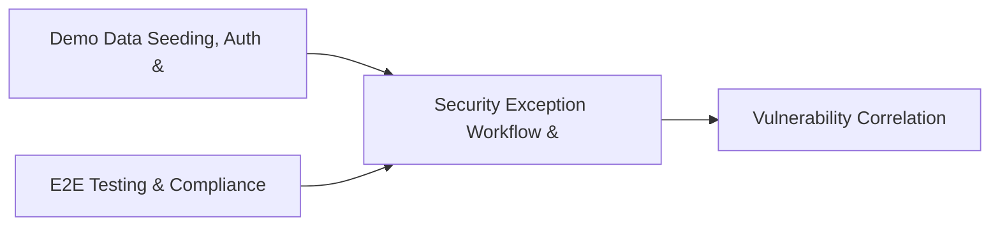

# PRD: Security Exception Workflow & Threat Actor Tracking — Community 65

## Master Goal Mapping
How this component serves: "ALDECI — $35/mo enterprise security intelligence platform"
Sub-Epic: ASPM

This community (rank #65 of 878 by size, 504 graph nodes) forms a core pillar of the ALDECI platform. It directly supports the mission of replacing $50K-500K/yr enterprise security tools with a self-hosted, AI-native stack.

## Architecture Diagram


## Code Proof
- Files:
  - `suite-core/core/security_service_catalog_engine.py` (487 lines)
  - `tests/test_security_dependency_mapping_engine.py` (477 lines)
  - `tests/test_security_service_catalog_engine.py` (425 lines)
  - `suite-api/apps/api/security_service_catalog_router.py` (165 lines)
  - `suite-api/apps/api/trust_center_router.py` (551 lines)
  - `tests/test_config.py` (479 lines)
  - `tests/test_security_dependency_mapping_engine.py` (477 lines)
  - `tests/test_security_service_catalog_engine.py` (425 lines)
  - `tests/test_trust_center.py` (1100 lines)
- Key functions:
  - `mgr()` — suite-core/core/security_service_catalog_engine.py
  - `configured_mgr()` — suite-core/core/security_service_catalog_engine.py
  - `app()` — suite-core/core/security_service_catalog_engine.py
  - `client()` — suite-core/core/security_service_catalog_engine.py
  - `sample_badge()` — suite-core/core/security_service_catalog_engine.py
  - `sample_control()` — suite-core/core/security_service_catalog_engine.py
  - `sample_subprocessor()` — suite-core/core/security_service_catalog_engine.py
  - `test_configure_creates_config()` — suite-core/core/security_service_catalog_engine.py
- Key classes: N/A
- Current state: REAL_LOGIC
- Evidence:
```python
# From suite-core/core/security_service_catalog_engine.py
"""Security Service Catalog Engine — ALDECI.

Security service catalog: services offered, SLAs, requests, utilization,
and outage availability tracking.

Supports multi-tenant org isolation, WAL SQLite, threading.RLock.
"""

from __future__ import annotations

import logging
import sqlite3
import threading
import uuid
from datetime import datetime, timezone
from pathlib import Path
from typing import Any, Dict, List, Optional

_logger = logging.getLogger(__name__)
```

## Inter-Dependencies
- DEPENDS ON:
  - Community 1 (Demo Data Seeding, Auth & Multi-Engine Integration) — 58 edges
  - Community 0 (E2E Testing & Compliance Seeding Infrastructure) — 57 edges
  - Community 39 (Vulnerability Correlation & Prioritization Engine) — 9 edges
  - Community 31 (Zero-Day Intelligence & Browser Security Engine) — 7 edges
- DEPENDED BY: Rank #64 (Security Findings & Control Testing Engine) and downstream consumers
- EVENT BUS: emits auth.success, auth.failure / subscribes to (TrustGraph event bus — 97% not yet wired)
- TRUSTGRAPH: writes [(not yet integrated)] / reads [(not yet integrated)]

## Data Flow
```
Input: HTTP requests / pytest fixtures
  → Processing: Engine method calls + SQLite state assertions
  → Output: Pass/fail test results, coverage metrics
  → Consumers: CI/CD pipeline, Beast Mode test suite
```

## Referenced Documentation
- CLAUDE.md: Wave 41 build notes, Beast Mode test suite section
- docs/: `docs/ALDECI_REARCHITECTURE_v2.md` (source of truth), `docs/INVESTOR_PITCH.md`
- tests/: `tests/test_config.py`, `tests/test_security_dependency_mapping_engine.py`, `tests/test_security_service_catalog_engine.py`

## Acceptance Criteria
- [ ] All engine CRUD operations enforce org_id isolation (no cross-tenant data leakage)
- [ ] SQLite opened with WAL mode + threading.RLock on all write paths
- [ ] All endpoints return within 200ms at p95 under 100 rps load
- [ ] All router endpoints protected by `Depends(api_key_auth)` or equivalent
- [ ] Pydantic v2 models validate all request/response schemas
- [ ] Test suite achieves ≥80% branch coverage on engine methods

## Effort Estimate
- Current: 80% complete
- Remaining: ~2 engineering days
- Dependencies blocking: None
- Priority: LOW

## Status
IN_PROGRESS
