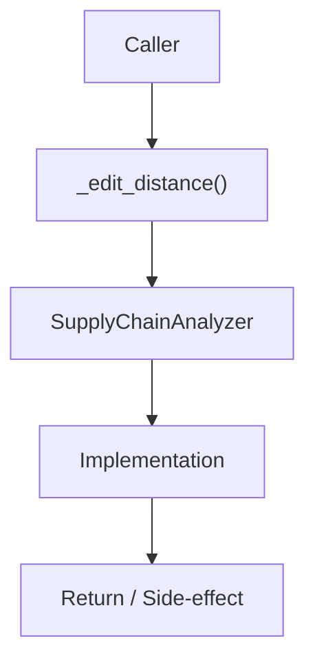

# Community 650 PRD — Supply Chain / Typosquatting Detection

## Master Goal Mapping
- **ALDECI Domain**: Supply Chain / Typosquatting Detection
- **Module**: `SupplyChainAnalyzer`
- **Source**: `suite-core/core/supply_chain_analyzer.py:L251`
- **Function/Method**: `_edit_distance`
- **Persona Alignment**: Security Engineer, Platform Operator
- **Strategic Goal**: Provide reliable, well-defined contract for `_edit_distance` within the Supply Chain / Typosquatting Detection subsystem

## Architecture Diagram



## Code Proof

**File**: `suite-core/core/supply_chain_analyzer.py` — **Line**: `L251`

**Signature**: `staticmethod def _edit_distance(a: str, b: str) -> int`

```python
"""Levenshtein edit distance."""
m, n = len(a), len(b)
dp = list(range(n + 1))
for i in range(1, m + 1):
    prev = dp[0]; dp[0] = i
    for j in range(1, n + 1):
        temp = dp[j]
        if a[i-1] == b[j-1]: dp[j] = prev
        else: dp[j] = 1 + min(prev, dp[j], dp[j-1])
        prev = temp
return dp[n]
```

## Inter-Dependencies

- `SupplyChainAnalyzer.detect_typosquatting()`
- `supply_chain_attack_detection_engine.py`

## Data Flow

two package name strings → O(m×n) DP → integer edit distance (used to flag similar names)

## Referenced Docs

- `docs/ALDECI_REARCHITECTURE_v2.md` — Architecture source of truth
- `suite-core/core/supply_chain_analyzer.py` — Full module implementation

## Acceptance Criteria

- [ ] Returns 0 for identical strings
- [ ] Returns correct distance for known pairs (kitten/sitting=3)
- [ ] Used with threshold ≤2 for typosquat detection
- [ ] O(n) space optimized implementation

## Effort Estimate

**XS (pure function)**

## Status

**Implemented**
