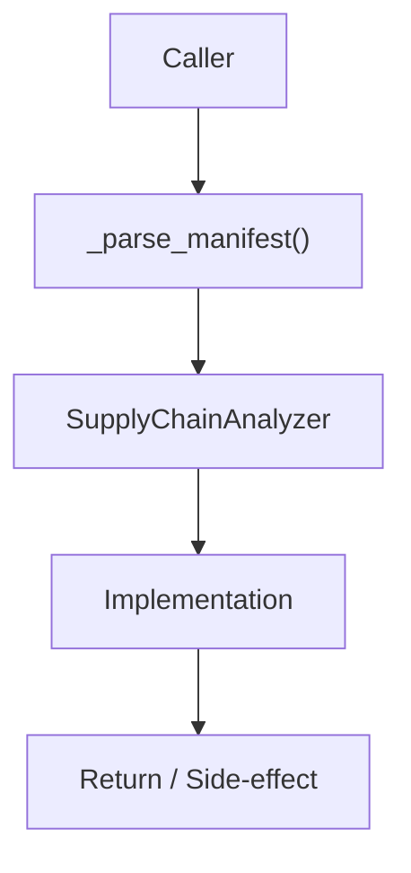

# Community 651 PRD — Supply Chain / Manifest Parsing

## Master Goal Mapping
- **ALDECI Domain**: Supply Chain / Manifest Parsing
- **Module**: `SupplyChainAnalyzer`
- **Source**: `suite-core/core/supply_chain_analyzer.py:L377`
- **Function/Method**: `_parse_manifest`
- **Persona Alignment**: Security Engineer, Platform Operator
- **Strategic Goal**: Provide reliable, well-defined contract for `_parse_manifest` within the Supply Chain / Manifest Parsing subsystem

## Architecture Diagram



## Code Proof

**File**: `suite-core/core/supply_chain_analyzer.py` — **Line**: `L377`

**Signature**: `staticmethod def _parse_manifest(path: str) -> List[Tuple[str, str]]`

```python
"""Parse requirements.txt or package.json into (name, version) tuples."""
```

## Inter-Dependencies

- `SupplyChainAnalyzer.scan_manifest()`
- `detect_typosquatting()`
- `check_known_malicious()`

## Data Flow

file path → detect format (pip vs npm) → parse entries → List[Tuple[name, version]]

## Referenced Docs

- `docs/ALDECI_REARCHITECTURE_v2.md` — Architecture source of truth
- `suite-core/core/supply_chain_analyzer.py` — Full module implementation

## Acceptance Criteria

- [ ] Parses requirements.txt pin syntax (pkg==1.0)
- [ ] Parses package.json dependencies block
- [ ] Returns empty list for unknown formats
- [ ] Handles version ranges gracefully

## Effort Estimate

**S**

## Status

**Implemented**
