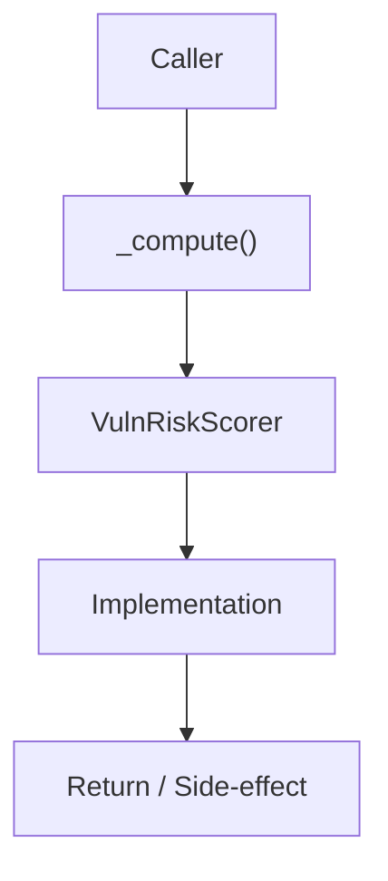

# Community 652 PRD — Vulnerability Risk Scoring

## Master Goal Mapping
- **ALDECI Domain**: Vulnerability Risk Scoring
- **Module**: `VulnRiskScorer`
- **Source**: `suite-core/core/vuln_risk_scoring.py:L137`
- **Function/Method**: `_compute`
- **Persona Alignment**: Security Engineer, Platform Operator
- **Strategic Goal**: Provide reliable, well-defined contract for `_compute` within the Vulnerability Risk Scoring subsystem

## Architecture Diagram



## Code Proof

**File**: `suite-core/core/vuln_risk_scoring.py` — **Line**: `L137`

**Signature**: `staticmethod def _compute(context: Dict) -> Dict`

```python
"""Pure scoring function — no side effects, no DB access."""
cvss_weight = cvss_base * 10
epss_weight = epss_score * 20
kev_bonus = 20.0 if kev else 0.0
exploit_bonus = 5.0 if has_known_exploit and not kev else 0.0
exposure_bonus = 10.0 if internet_exposed else 0.0
raw = (cvss_weight + epss_weight + kev_bonus + exploit_bonus + exposure_bonus)
composite = min(raw * criticality_multiplier, 100.0)
```

## Inter-Dependencies

- `_CRITICALITY_MULTIPLIER dict`
- `VulnRiskScorer.score()`
- `vuln_prioritization_engine.py`

## Data Flow

context dict → weighted formula → composite score 0-100 + verdict

## Referenced Docs

- `docs/ALDECI_REARCHITECTURE_v2.md` — Architecture source of truth
- `suite-core/core/vuln_risk_scoring.py` — Full module implementation

## Acceptance Criteria

- [ ] No DB access or side effects
- [ ] KEV bonus=20, EPSS weight=×20, CVSS weight=×10
- [ ] Criticality multiplier applied post-sum
- [ ] Score clamped to [0, 100]
- [ ] Returns dict with score + verdict

## Effort Estimate

**XS (pure function)**

## Status

**Implemented**
