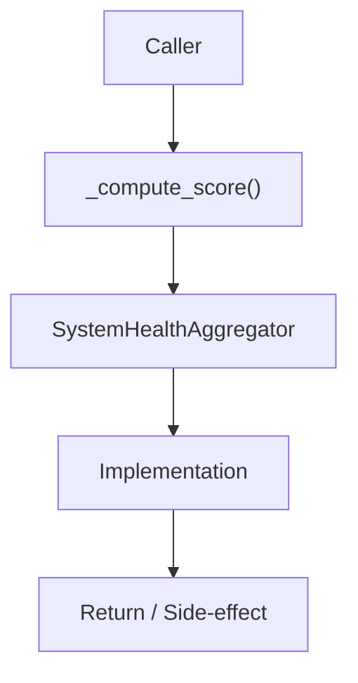

# Community 656 PRD — System Health Scoring

## Master Goal Mapping
- **ALDECI Domain**: System Health Scoring
- **Module**: `SystemHealthAggregator`
- **Source**: `suite-core/core/system_health_aggregator.py:L271`
- **Function/Method**: `_compute_score`
- **Persona Alignment**: Security Engineer, Platform Operator
- **Strategic Goal**: Provide reliable, well-defined contract for `_compute_score` within the System Health Scoring subsystem

## Architecture Diagram



## Code Proof

**File**: `suite-core/core/system_health_aggregator.py` — **Line**: `L271`

**Signature**: `staticmethod def _compute_score(summary: Dict[str, int], total: int) -> int`

```python
"""Weighted score:
  healthy    → full weight  (1.0)
  degraded   → half weight  (0.5)
  unavailable→ zero weight  (0.0)
"""
if total == 0: return 0
weighted = summary["healthy"] * 1.0 + summary["degraded"] * 0.5
return round((weighted / total) * 100)
```

## Inter-Dependencies

- `_overall_status (L284)`
- `SystemHealthAggregator.aggregate()`
- `security_health_engine.py`

## Data Flow

summary counts + total → weighted ratio → integer 0-100

## Referenced Docs

- `docs/ALDECI_REARCHITECTURE_v2.md` — Architecture source of truth
- `suite-core/core/system_health_aggregator.py` — Full module implementation

## Acceptance Criteria

- [ ] Returns 0 when total=0
- [ ] Returns 100 when all healthy
- [ ] Returns 50 when all degraded
- [ ] Returns 0 when all unavailable

## Effort Estimate

**XS (pure function)**

## Status

**Implemented**
