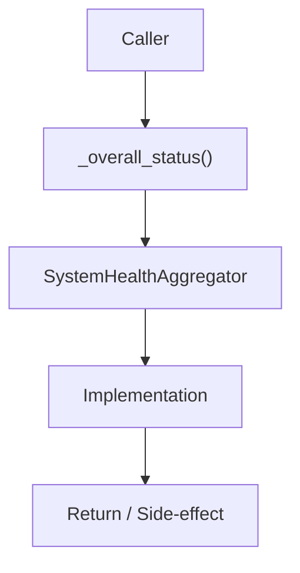

# Community 657 PRD — System Health Status Classification

## Master Goal Mapping
- **ALDECI Domain**: System Health Status Classification
- **Module**: `SystemHealthAggregator`
- **Source**: `suite-core/core/system_health_aggregator.py:L284`
- **Function/Method**: `_overall_status`
- **Persona Alignment**: Security Engineer, Platform Operator
- **Strategic Goal**: Provide reliable, well-defined contract for `_overall_status` within the System Health Status Classification subsystem

## Architecture Diagram



## Code Proof

**File**: `suite-core/core/system_health_aggregator.py` — **Line**: `L284`

**Signature**: `staticmethod def _overall_status(summary: Dict[str, int], total: int) -> str`

```python
"""healthy — all engines healthy
degraded — some engines degraded or a few unavailable
unavailable — majority of engines unavailable
"""
if total == 0: return "unavailable"
unavail_pct = summary["unavailable"] / total
if unavail_pct > 0.5: return "unavailable"
if summary["degraded"] > 0 or summary["unavailable"] > 0: return "degraded"
return "healthy"
```

## Inter-Dependencies

- `_compute_score (L271)`
- `SystemHealthAggregator.aggregate()`

## Data Flow

summary + total → threshold checks → status string

## Referenced Docs

- `docs/ALDECI_REARCHITECTURE_v2.md` — Architecture source of truth
- `suite-core/core/system_health_aggregator.py` — Full module implementation

## Acceptance Criteria

- [ ] Returns 'unavailable' when >50% engines down
- [ ] Returns 'degraded' with any degraded/unavailable engines
- [ ] Returns 'healthy' only when all engines healthy

## Effort Estimate

**XS**

## Status

**Implemented**
