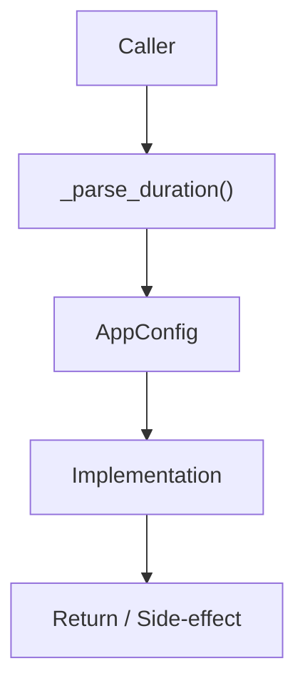

# Community 659 PRD — Configuration / Duration Parsing

## Master Goal Mapping
- **ALDECI Domain**: Configuration / Duration Parsing
- **Module**: `AppConfig`
- **Source**: `suite-core/core/app_config.py:L124`
- **Function/Method**: `_parse_duration`
- **Persona Alignment**: Security Engineer, Platform Operator
- **Strategic Goal**: Provide reliable, well-defined contract for `_parse_duration` within the Configuration / Duration Parsing subsystem

## Architecture Diagram



## Code Proof

**File**: `suite-core/core/app_config.py` — **Line**: `L124`

**Signature**: `staticmethod def _parse_duration(value: str) -> timedelta`

```python
"""Accept durations like 24h, 72h, 14d, 30d, 1y."""
```

## Inter-Dependencies

- `AppConfig.session_ttl`
- `AppConfig.token_expiry`
- `app_config.py settings validators`

## Data Flow

string like '30d' → regex parse → timedelta(days=30)

## Referenced Docs

- `docs/ALDECI_REARCHITECTURE_v2.md` — Architecture source of truth
- `suite-core/core/app_config.py` — Full module implementation

## Acceptance Criteria

- [ ] Parses Nh for hours
- [ ] Parses Nd for days
- [ ] Parses Ny for years
- [ ] Raises ValueError for invalid format

## Effort Estimate

**XS**

## Status

**Implemented**
