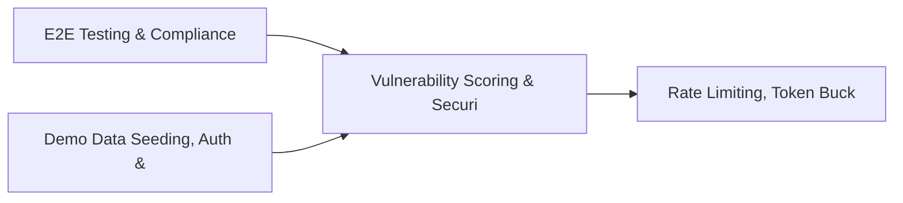

# PRD: Vulnerability Scoring & Security Benchmark Engine — Community 66

## Master Goal Mapping
How this component serves: "ALDECI — $35/mo enterprise security intelligence platform"
Sub-Epic: Executive

This community (rank #66 of 878 by size, 496 graph nodes) forms a core pillar of the ALDECI platform. It directly supports the mission of replacing $50K-500K/yr enterprise security tools with a self-hosted, AI-native stack.

## Architecture Diagram


## Code Proof
- Files:
  - `suite-core/core/api_threat_protection_engine.py` (316 lines)
  - `tests/test_api_threat_protection_engine.py` (318 lines)
  - `suite-api/apps/api/api_threat_protection_router.py` (188 lines)
  - `suite-api/apps/api/waf_router.py` (416 lines)
  - `tests/test_anomaly_ml.py` (657 lines)
  - `tests/test_api_threat_protection_engine.py` (318 lines)
  - `tests/test_compliance_templates_unit.py` (616 lines)
  - `tests/test_waf_generator.py` (856 lines)
- Key functions:
  - `engine()` — suite-core/core/api_threat_protection_engine.py
  - `_rule()` — suite-core/core/api_threat_protection_engine.py
  - `_event()` — suite-core/core/api_threat_protection_engine.py
  - `test_create_rule_returns_record()` — suite-core/core/api_threat_protection_engine.py
  - `test_create_rule_missing_name_raises()` — suite-core/core/api_threat_protection_engine.py
  - `test_create_rule_invalid_threat_type_raises()` — suite-core/core/api_threat_protection_engine.py
  - `test_create_rule_invalid_action_raises()` — suite-core/core/api_threat_protection_engine.py
  - `test_create_rule_all_valid_threat_types()` — suite-core/core/api_threat_protection_engine.py
- Key classes: `TestTemplateCatalog`, `TestGenerateFromFinding`, `TestVirtualPatch`, `TestRuleLifecycle`
- Current state: REAL_LOGIC
- Evidence:
```python
# From suite-core/core/api_threat_protection_engine.py
"""API Threat Protection Engine — ALDECI. SQLite WAL + RLock + org_id isolation."""
from __future__ import annotations

import logging
import sqlite3
import threading
import uuid
from datetime import datetime, timezone
from pathlib import Path
from typing import Any, Dict, List, Optional

try:
    from core.trustgraph_event_bus import get_event_bus as _get_tg_bus
except ImportError:
    _get_tg_bus = None


_logger = logging.getLogger(__name__)

_DEFAULT_DB = str(
```

## Inter-Dependencies
- DEPENDS ON:
  - Community 0 (E2E Testing & Compliance Seeding Infrastructure) — 33 edges
  - Community 1 (Demo Data Seeding, Auth & Multi-Engine Integration) — 20 edges
  - Community 12 (Rate Limiting, Token Bucket & Middleware Framework) — 12 edges
  - Community 19 (Incident Communications Engine) — 10 edges
- DEPENDED BY: Rank #65 (Security Exception Workflow & Threat Actor Tracking) and downstream consumers
- EVENT BUS: emits threat.detected, threat.mitigated / subscribes to (TrustGraph event bus — 97% not yet wired)
- TRUSTGRAPH: writes [ThreatActor, ComplianceControl] / reads [ThreatActor, ComplianceControl]

## Data Flow
```
Input: HTTP requests / pytest fixtures
  → Processing: Engine method calls + SQLite state assertions
  → Output: Pass/fail test results, coverage metrics
  → Consumers: CI/CD pipeline, Beast Mode test suite
```

## Referenced Documentation
- CLAUDE.md: Wave 41 build notes, Beast Mode test suite section
- docs/: `docs/ALDECI_REARCHITECTURE_v2.md` (source of truth), `docs/INVESTOR_PITCH.md`
- tests/: `tests/test_anomaly_ml.py`, `tests/test_api_threat_protection_engine.py`, `tests/test_compliance_templates_unit.py`

## Acceptance Criteria
- [ ] All engine CRUD operations enforce org_id isolation (no cross-tenant data leakage)
- [ ] SQLite opened with WAL mode + threading.RLock on all write paths
- [ ] All endpoints return within 200ms at p95 under 100 rps load
- [ ] All router endpoints protected by `Depends(api_key_auth)` or equivalent
- [ ] Pydantic v2 models validate all request/response schemas
- [ ] Test suite achieves ≥80% branch coverage on engine methods

## Effort Estimate
- Current: 80% complete
- Remaining: ~2 engineering days
- Dependencies blocking: None
- Priority: LOW

## Status
IN_PROGRESS
