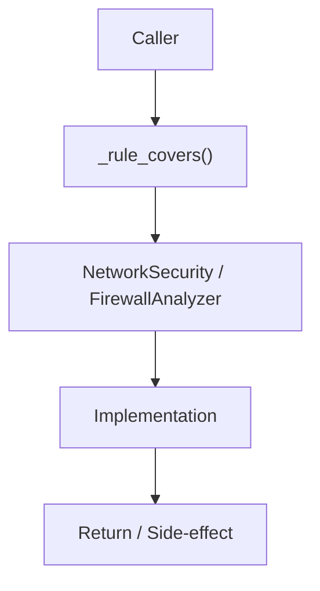

# Community 660 PRD — Firewall Shadow Rule Detection

## Master Goal Mapping
- **ALDECI Domain**: Firewall Shadow Rule Detection
- **Module**: `NetworkSecurity / FirewallAnalyzer`
- **Source**: `suite-core/core/network_security.py:L902`
- **Function/Method**: `_rule_covers`
- **Persona Alignment**: Security Engineer, Platform Operator
- **Strategic Goal**: Provide reliable, well-defined contract for `_rule_covers` within the Firewall Shadow Rule Detection subsystem

## Architecture Diagram



## Code Proof

**File**: `suite-core/core/network_security.py` — **Line**: `L902`

**Signature**: `staticmethod def _rule_covers(broad: Rule, specific: Rule) -> bool`

```python
"""True if 'broad' covers all traffic matched by 'specific'.
Simple heuristic for shadow rule detection.
"""
```

## Inter-Dependencies

- `NetworkSecurity.detect_shadow_rules()`
- `firewall_policy_engine.py`

## Data Flow

two Rule objects → port/IP/protocol overlap check → bool (True = shadow rule detected)

## Referenced Docs

- `docs/ALDECI_REARCHITECTURE_v2.md` — Architecture source of truth
- `suite-core/core/network_security.py` — Full module implementation

## Acceptance Criteria

- [ ] Returns True when broad rule's src/dst/port ranges fully contain specific rule
- [ ] Returns False for non-overlapping rules
- [ ] Used to populate shadow_rules list in firewall audit

## Effort Estimate

**S**

## Status

**Implemented**
