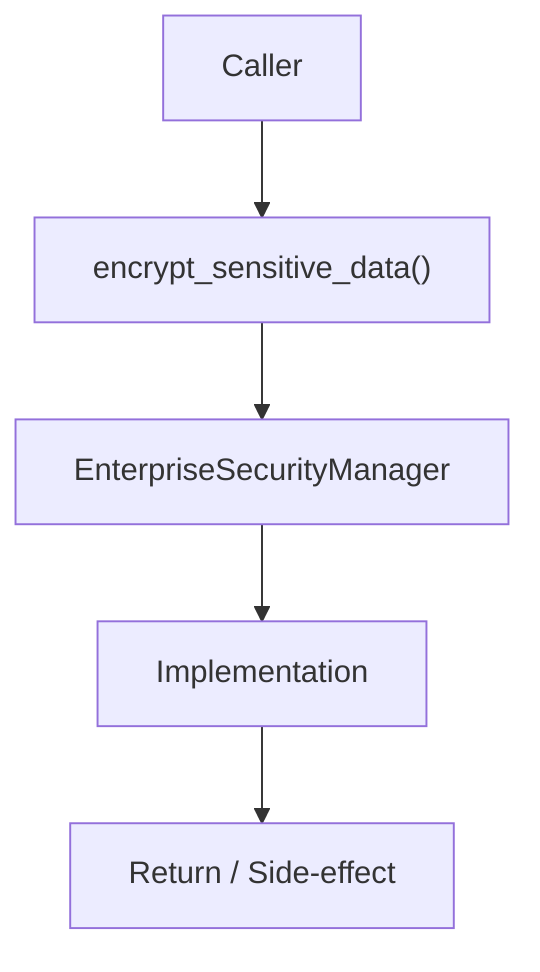

# Community 666 PRD — Enterprise Security / PII Encryption

## Master Goal Mapping
- **ALDECI Domain**: Enterprise Security / PII Encryption
- **Module**: `EnterpriseSecurityManager`
- **Source**: `suite-core/core/enterprise/security.py:L96`
- **Function/Method**: `encrypt_sensitive_data`
- **Persona Alignment**: Security Engineer, Platform Operator
- **Strategic Goal**: Provide reliable, well-defined contract for `encrypt_sensitive_data` within the Enterprise Security / PII Encryption subsystem

## Architecture Diagram



## Code Proof

**File**: `suite-core/core/enterprise/security.py` — **Line**: `L96`

**Signature**: `classmethod def encrypt_sensitive_data(cls, data: str) -> str`

```python
"""Encrypt sensitive data (PII, credentials, etc.)
if not cls._fernet:
    raise RuntimeError("Security manager not initialized")
encrypted_data = cls._fernet.encrypt(data.encode())
return encrypted_data.decode()
```

## Inter-Dependencies

- `Fernet._fernet instance`
- `EnterpriseSecurityManager.initialize()`
- `decrypt_sensitive_data()`

## Data Flow

plaintext str → Fernet.encrypt → base64-encoded ciphertext str

## Referenced Docs

- `docs/ALDECI_REARCHITECTURE_v2.md` — Architecture source of truth
- `suite-core/core/enterprise/security.py` — Full module implementation

## Acceptance Criteria

- [ ] Returns encrypted non-reversible-without-key string
- [ ] Raises RuntimeError if not initialized
- [ ] Output decodable only by decrypt_sensitive_data()
- [ ] Uses AES-128-CBC with HMAC

## Effort Estimate

**XS**

## Status

**Implemented**
