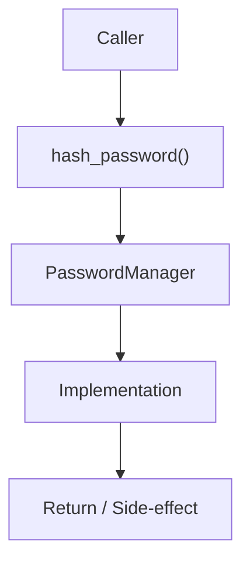

# Community 667 PRD — Enterprise Security / Password Hashing

## Master Goal Mapping
- **ALDECI Domain**: Enterprise Security / Password Hashing
- **Module**: `PasswordManager`
- **Source**: `suite-core/core/enterprise/security.py:L118`
- **Function/Method**: `hash_password`
- **Persona Alignment**: Security Engineer, Platform Operator
- **Strategic Goal**: Provide reliable, well-defined contract for `hash_password` within the Enterprise Security / Password Hashing subsystem

## Architecture Diagram



## Code Proof

**File**: `suite-core/core/enterprise/security.py` — **Line**: `L118`

**Signature**: `staticmethod def hash_password(password: str) -> str`

```python
"""Hash password with bcrypt (enterprise-grade)
return pwd_context.hash(password)
```

## Inter-Dependencies

- `passlib.context.CryptContext (pwd_context)`
- `verify_password()`
- `user schemas`

## Data Flow

plaintext password → bcrypt hash → stored hash string

## Referenced Docs

- `docs/ALDECI_REARCHITECTURE_v2.md` — Architecture source of truth
- `suite-core/core/enterprise/security.py` — Full module implementation

## Acceptance Criteria

- [ ] Returns bcrypt hash string
- [ ] Hash is not reversible
- [ ] Uses pwd_context with rounds>=12
- [ ] verify_password() can validate against it

## Effort Estimate

**XS**

## Status

**Implemented**
