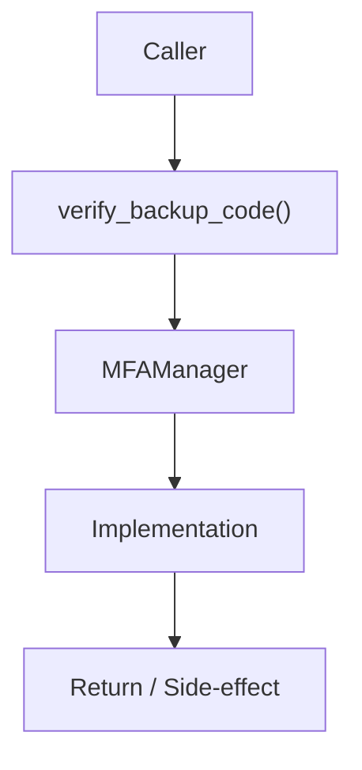

# Community 668 PRD — MFA / Backup Code Verification

## Master Goal Mapping
- **ALDECI Domain**: MFA / Backup Code Verification
- **Module**: `MFAManager`
- **Source**: `suite-core/core/enterprise/security.py:L158`
- **Function/Method**: `verify_backup_code`
- **Persona Alignment**: Security Engineer, Platform Operator
- **Strategic Goal**: Provide reliable, well-defined contract for `verify_backup_code` within the MFA / Backup Code Verification subsystem

## Architecture Diagram



## Code Proof

**File**: `suite-core/core/enterprise/security.py` — **Line**: `L158`

**Signature**: `staticmethod async def verify_backup_code(user_id: int, code: str) -> bool`

```python
"""Verify backup code (one-time use)
cache_key = f"backup_codes:{user_id}"
used_codes = await cache.get(cache_key) or []
if code in used_codes: return False
```

## Inter-Dependencies

- `CacheService.get_instance()`
- `Redis backup_codes:{user_id} key`
- `setup_totp()`

## Data Flow

user_id + code → Redis lookup → check used_codes list → bool; marks code used on success

## Referenced Docs

- `docs/ALDECI_REARCHITECTURE_v2.md` — Architecture source of truth
- `suite-core/core/enterprise/security.py` — Full module implementation

## Acceptance Criteria

- [ ] Returns False for already-used codes
- [ ] Returns True and marks code used on first use
- [ ] Each backup code valid exactly once
- [ ] Uses Redis for used-code tracking

## Effort Estimate

**S**

## Status

**Implemented**
