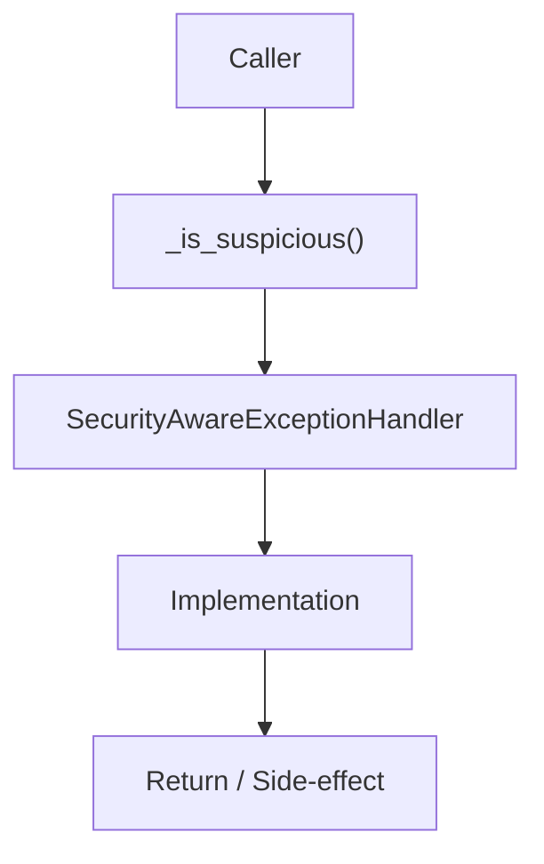

# Community 669 PRD — Enterprise Exception Security Analysis

## Master Goal Mapping
- **ALDECI Domain**: Enterprise Exception Security Analysis
- **Module**: `SecurityAwareExceptionHandler`
- **Source**: `suite-core/core/enterprise/exceptions.py:L413`
- **Function/Method**: `_is_suspicious`
- **Persona Alignment**: Security Engineer, Platform Operator
- **Strategic Goal**: Provide reliable, well-defined contract for `_is_suspicious` within the Enterprise Exception Security Analysis subsystem

## Architecture Diagram



## Code Proof

**File**: `suite-core/core/enterprise/exceptions.py` — **Line**: `L413`

**Signature**: `staticmethod def _is_suspicious(exc: Exception) -> bool`

```python
"""Check if exception contains suspicious patterns"""
```

## Inter-Dependencies

- `_SUSPICIOUS_PATTERNS list`
- `_extract_security_context (L421)`
- `SecurityMiddleware`

## Data Flow

exception → string analysis against pattern list → bool (True triggers security alert)

## Referenced Docs

- `docs/ALDECI_REARCHITECTURE_v2.md` — Architecture source of truth
- `suite-core/core/enterprise/exceptions.py` — Full module implementation

## Acceptance Criteria

- [ ] Detects SQL injection patterns
- [ ] Detects path traversal patterns
- [ ] Detects SSRF patterns
- [ ] Returns False for benign exceptions

## Effort Estimate

**XS**

## Status

**Implemented**
