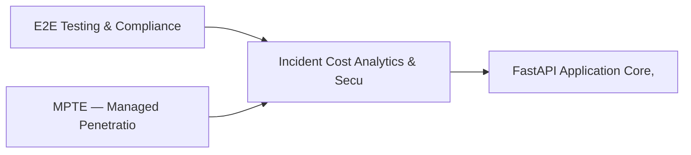

# PRD: Incident Cost Analytics & Security Culture Engine — Community 67

## Master Goal Mapping
How this component serves: "ALDECI — $35/mo enterprise security intelligence platform"
Sub-Epic: GRC

This community (rank #67 of 878 by size, 470 graph nodes) forms a core pillar of the ALDECI platform. It directly supports the mission of replacing $50K-500K/yr enterprise security tools with a self-hosted, AI-native stack.

## Architecture Diagram


## Code Proof
- Files:
  - `suite-core/core/iac_scanner_engine.py` (1889 lines)
  - `suite-api/apps/api/dep_scanner_router.py` (231 lines)
  - `suite-integrations/api/iac_router.py` (243 lines)
  - `tests/test_cicd_integration.py` (611 lines)
  - `tests/test_dast_scanner.py` (1319 lines)
  - `tests/test_iac_api.py` (241 lines)
  - `tests/test_iac_scanner.py` (1286 lines)
  - `tests/test_safe_path_ops.py` (712 lines)
- Key functions:
  - `list_iac_findings()` — suite-core/core/iac_scanner_engine.py
  - `create_iac_finding()` — suite-core/core/iac_scanner_engine.py
  - `get_iac_finding()` — suite-core/core/iac_scanner_engine.py
  - `resolve_iac_finding()` — suite-core/core/iac_scanner_engine.py
  - `remediate_iac_finding()` — suite-core/core/iac_scanner_engine.py
  - `get_scanner_status()` — suite-core/core/iac_scanner_engine.py
  - `scan_iac_content()` — suite-core/core/iac_scanner_engine.py
  - `_make_scanner()` — suite-core/core/iac_scanner_engine.py
- Key classes: `IaCFindingCreate`, `IaCFindingResponse`, `PaginatedIaCFindingResponse`, `IaCScanResponse`, `ScannerStatusResponse`, `IaCScanContentRequest`
- Current state: REAL_LOGIC
- Evidence:
```python
# From suite-core/core/iac_scanner_engine.py
"""IaC Security Scanner Engine — Infrastructure-as-Code vulnerability detection.

Scans Terraform, CloudFormation, Kubernetes, Helm, Ansible, and Dockerfiles
for security misconfigurations. Provides fix suggestions, compliance mapping,
custom policy-as-code rules, and drift detection stubs.

Usage:
    from core.iac_scanner_engine import IaCScannerEngine, get_iac_scanner

    scanner = get_iac_scanner()
    result = scanner.scan_content(content="...", filename="main.tf")
"""

from __future__ import annotations

import hashlib
import json
import re
import time
import uuid
```

## Inter-Dependencies
- DEPENDS ON:
  - Community 0 (E2E Testing & Compliance Seeding Infrastructure) — 36 edges
  - Community 13 (MPTE — Managed Penetration Test Engine (Advanced)) — 24 edges
  - Community 4 (FastAPI Application Core, Feedback & Smoke Testing) — 11 edges
  - Community 41 (Compliance Calendar & Cyber Resilience Engine) — 7 edges
- DEPENDED BY: Rank #66 (Vulnerability Scoring & Security Benchmark Engine) and downstream consumers
- EVENT BUS: emits scan.completed, scan.finding / subscribes to (TrustGraph event bus — 97% not yet wired)
- TRUSTGRAPH: writes [CloudResource] / reads [CloudResource]

## Data Flow
```
Input: HTTP requests / pytest fixtures
  → Processing: Engine method calls + SQLite state assertions
  → Output: Pass/fail test results, coverage metrics
  → Consumers: CI/CD pipeline, Beast Mode test suite
```

## Referenced Documentation
- CLAUDE.md: Wave 41 build notes, Beast Mode test suite section
- docs/: `docs/ALDECI_REARCHITECTURE_v2.md` (source of truth), `docs/INVESTOR_PITCH.md`
- tests/: `tests/test_cicd_integration.py`, `tests/test_dast_scanner.py`, `tests/test_iac_api.py`

## Acceptance Criteria
- [ ] All engine CRUD operations enforce org_id isolation (no cross-tenant data leakage)
- [ ] SQLite opened with WAL mode + threading.RLock on all write paths
- [ ] All endpoints return within 200ms at p95 under 100 rps load
- [ ] All router endpoints protected by `Depends(api_key_auth)` or equivalent
- [ ] Pydantic v2 models validate all request/response schemas
- [ ] Test suite achieves ≥80% branch coverage on engine methods

## Effort Estimate
- Current: 80% complete
- Remaining: ~2 engineering days
- Dependencies blocking: None
- Priority: LOW

## Status
IN_PROGRESS
