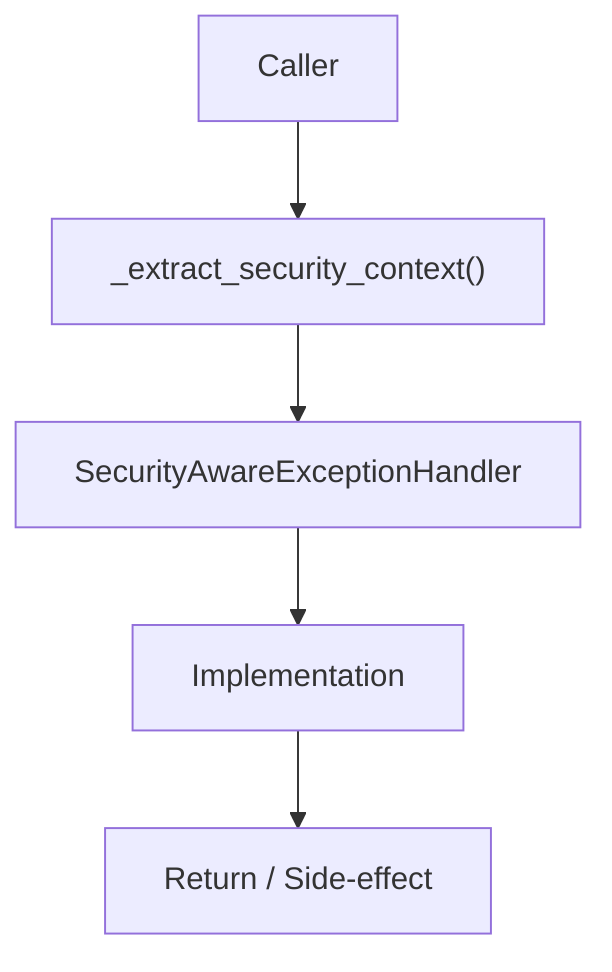

# Community 670 PRD — Enterprise Exception Security Context

## Master Goal Mapping
- **ALDECI Domain**: Enterprise Exception Security Context
- **Module**: `SecurityAwareExceptionHandler`
- **Source**: `suite-core/core/enterprise/exceptions.py:L421`
- **Function/Method**: `_extract_security_context`
- **Persona Alignment**: Security Engineer, Platform Operator
- **Strategic Goal**: Provide reliable, well-defined contract for `_extract_security_context` within the Enterprise Exception Security Context subsystem

## Architecture Diagram



## Code Proof

**File**: `suite-core/core/enterprise/exceptions.py` — **Line**: `L421`

**Signature**: `staticmethod def _extract_security_context(exc, request) -> Dict`

```python
"""Extract security context from exception and request"""
```

## Inter-Dependencies

- `_is_suspicious (L413)`
- `AuditLogger.get_instance()`
- `SecurityIncident model`

## Data Flow

exception + FastAPI Request → extract IP/user/path/exception-type → Dict for audit log

## Referenced Docs

- `docs/ALDECI_REARCHITECTURE_v2.md` — Architecture source of truth
- `suite-core/core/enterprise/exceptions.py` — Full module implementation

## Acceptance Criteria

- [ ] Captures client IP from request
- [ ] Captures user identity if authenticated
- [ ] Captures exception type and sanitized message
- [ ] Used to create SecurityIncident records

## Effort Estimate

**XS**

## Status

**Implemented**
