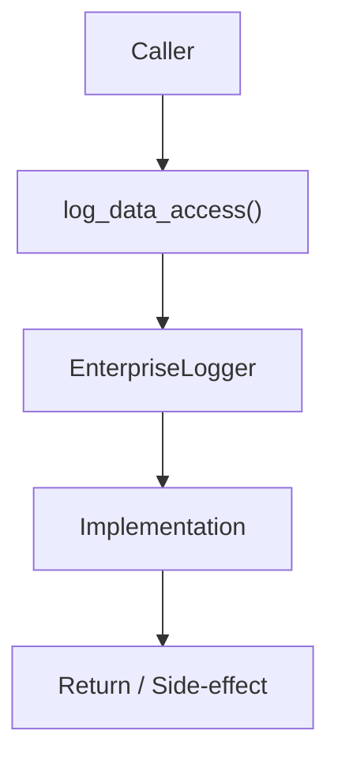

# Community 671 PRD — Compliance Audit Logging / GDPR

## Master Goal Mapping
- **ALDECI Domain**: Compliance Audit Logging / GDPR
- **Module**: `EnterpriseLogger`
- **Source**: `suite-core/core/utils/enterprise/logger.py:L191`
- **Function/Method**: `log_data_access`
- **Persona Alignment**: Security Engineer, Platform Operator
- **Strategic Goal**: Provide reliable, well-defined contract for `log_data_access` within the Compliance Audit Logging / GDPR subsystem

## Architecture Diagram



## Code Proof

**File**: `suite-core/core/utils/enterprise/logger.py` — **Line**: `L191`

**Signature**: `def log_data_access(user_id, resource_type, resource_id, action, org_id) -> None`

```python
"""Log data access for compliance (GDPR, HIPAA, etc.)"""
```

## Inter-Dependencies

- `AuditLogger.get_instance()`
- `structlog`
- `compliance_evidence_collector.py`

## Data Flow

user_id + resource + action + org_id → structured log entry → audit DB + log sink

## Referenced Docs

- `docs/ALDECI_REARCHITECTURE_v2.md` — Architecture source of truth
- `suite-core/core/utils/enterprise/logger.py` — Full module implementation

## Acceptance Criteria

- [ ] Records user_id, resource_type, resource_id, action
- [ ] Includes org_id for multi-tenant isolation
- [ ] Persisted to audit log DB
- [ ] Used by GDPR DSR and evidence collection

## Effort Estimate

**XS**

## Status

**Implemented**
