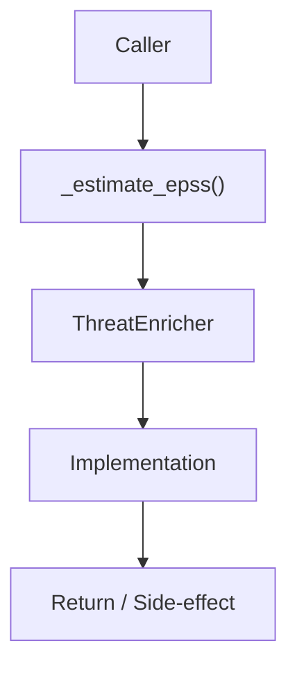

# Community 672 PRD — ML / CVE Enrichment Fallback

## Master Goal Mapping
- **ALDECI Domain**: ML / CVE Enrichment Fallback
- **Module**: `ThreatEnricher`
- **Source**: `suite-core/core/ml/threat_enricher.py:L472`
- **Function/Method**: `_estimate_epss`
- **Persona Alignment**: Security Engineer, Platform Operator
- **Strategic Goal**: Provide reliable, well-defined contract for `_estimate_epss` within the ML / CVE Enrichment Fallback subsystem

## Architecture Diagram



## Code Proof

**File**: `suite-core/core/ml/threat_enricher.py` — **Line**: `L472`

**Signature**: `staticmethod def _estimate_epss(severity: str) -> float`

```python
"""Estimate EPSS score from severity when API data is unavailable.
This uses heuristic mapping from severity to approximate EPSS range.
"""
```

## Inter-Dependencies

- `_SEVERITY_EPSS_MAP constant`
- `ThreatEnricher.enrich_cve()`
- `cve_enrichment_engine.py`

## Data Flow

severity string (critical/high/medium/low) → lookup table → float EPSS estimate

## Referenced Docs

- `docs/ALDECI_REARCHITECTURE_v2.md` — Architecture source of truth
- `suite-core/core/ml/threat_enricher.py` — Full module implementation

## Acceptance Criteria

- [ ] Returns higher estimate for critical/high
- [ ] Returns lower estimate for low
- [ ] Used as fallback when EPSS API unreachable
- [ ] Values in [0, 1] range

## Effort Estimate

**XS (pure lookup)**

## Status

**Implemented**
