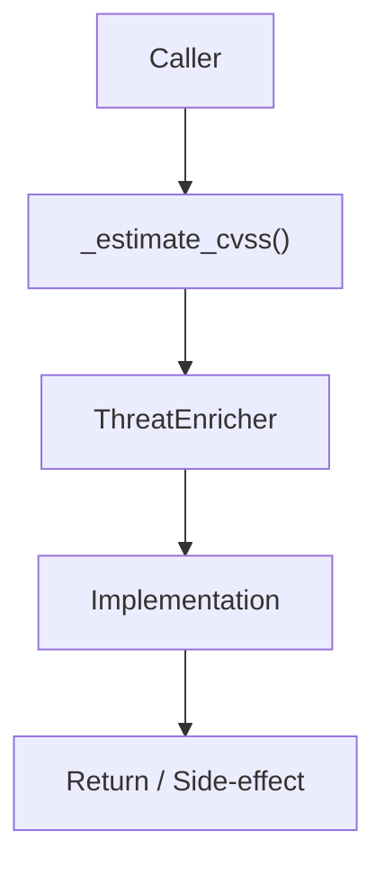

# Community 673 PRD — ML / CVSS Score Estimation

## Master Goal Mapping
- **ALDECI Domain**: ML / CVSS Score Estimation
- **Module**: `ThreatEnricher`
- **Source**: `suite-core/core/ml/threat_enricher.py:L509`
- **Function/Method**: `_estimate_cvss`
- **Persona Alignment**: Security Engineer, Platform Operator
- **Strategic Goal**: Provide reliable, well-defined contract for `_estimate_cvss` within the ML / CVSS Score Estimation subsystem

## Architecture Diagram



## Code Proof

**File**: `suite-core/core/ml/threat_enricher.py` — **Line**: `L509`

**Signature**: `staticmethod def _estimate_cvss(severity: str) -> float`

```python
"""Estimate CVSS score from severity label."""
```

## Inter-Dependencies

- `_SEVERITY_CVSS_MAP constant`
- `ThreatEnricher.enrich_cve()`
- `vuln_intelligence_engine.py`

## Data Flow

severity string → CVSS range midpoint lookup → float score (0-10)

## Referenced Docs

- `docs/ALDECI_REARCHITECTURE_v2.md` — Architecture source of truth
- `suite-core/core/ml/threat_enricher.py` — Full module implementation

## Acceptance Criteria

- [ ] critical → ~9.0
- [ ] high → ~7.5
- [ ] medium → ~5.0
- [ ] low → ~2.5
- [ ] Returns float in [0, 10]

## Effort Estimate

**XS**

## Status

**Implemented**
