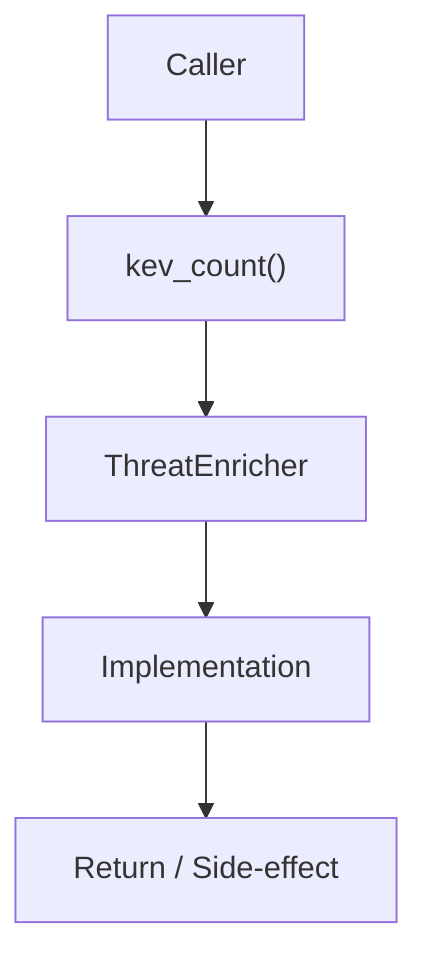

# Community 674 PRD — KEV Catalog / Cache Stats

## Master Goal Mapping
- **ALDECI Domain**: KEV Catalog / Cache Stats
- **Module**: `ThreatEnricher`
- **Source**: `suite-core/core/ml/threat_enricher.py:L575`
- **Function/Method**: `kev_count`
- **Persona Alignment**: Security Engineer, Platform Operator
- **Strategic Goal**: Provide reliable, well-defined contract for `kev_count` within the KEV Catalog / Cache Stats subsystem

## Architecture Diagram



## Code Proof

**File**: `suite-core/core/ml/threat_enricher.py` — **Line**: `L575`

**Signature**: `@property def kev_count(self) -> int`

```python
"""Total number of CVEs in KEV catalog."""
```

## Inter-Dependencies

- `_kev_cache dict`
- `ThreatEnricher.load_kev()`
- `cve_enrichment_engine.py`

## Data Flow

no input → len(_kev_cache) → int

## Referenced Docs

- `docs/ALDECI_REARCHITECTURE_v2.md` — Architecture source of truth
- `suite-core/core/ml/threat_enricher.py` — Full module implementation

## Acceptance Criteria

- [ ] Returns 0 before KEV loaded
- [ ] Returns correct count after load_kev()
- [ ] Used in health check and metrics endpoints

## Effort Estimate

**XS**

## Status

**Implemented**
