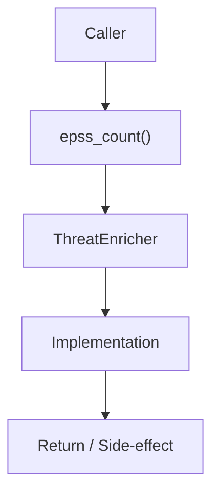

# Community 675 PRD — EPSS Cache Stats

## Master Goal Mapping
- **ALDECI Domain**: EPSS Cache Stats
- **Module**: `ThreatEnricher`
- **Source**: `suite-core/core/ml/threat_enricher.py:L580`
- **Function/Method**: `epss_count`
- **Persona Alignment**: Security Engineer, Platform Operator
- **Strategic Goal**: Provide reliable, well-defined contract for `epss_count` within the EPSS Cache Stats subsystem

## Architecture Diagram



## Code Proof

**File**: `suite-core/core/ml/threat_enricher.py` — **Line**: `L580`

**Signature**: `@property def epss_count(self) -> int`

```python
"""Number of EPSS scores in cache."""
```

## Inter-Dependencies

- `_epss_cache dict`
- `ThreatEnricher.load_epss()`
- `vuln_intelligence_engine.py`

## Data Flow

no input → len(_epss_cache) → int

## Referenced Docs

- `docs/ALDECI_REARCHITECTURE_v2.md` — Architecture source of truth
- `suite-core/core/ml/threat_enricher.py` — Full module implementation

## Acceptance Criteria

- [ ] Returns 0 before EPSS data loaded
- [ ] Returns correct count after load
- [ ] Used in health/diagnostics

## Effort Estimate

**XS**

## Status

**Implemented**
