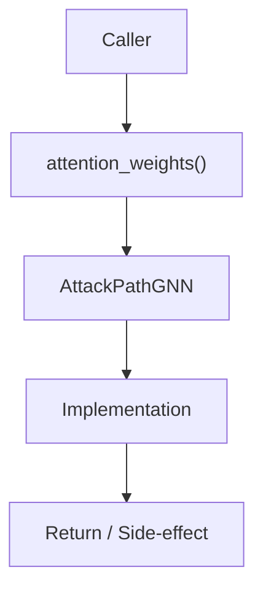

# Community 676 PRD — GNN / Attack Path Explainability

## Master Goal Mapping
- **ALDECI Domain**: GNN / Attack Path Explainability
- **Module**: `AttackPathGNN`
- **Source**: `suite-core/core/ml/attack_path_gnn.py:L319`
- **Function/Method**: `attention_weights`
- **Persona Alignment**: Security Engineer, Platform Operator
- **Strategic Goal**: Provide reliable, well-defined contract for `attention_weights` within the GNN / Attack Path Explainability subsystem

## Architecture Diagram



## Code Proof

**File**: `suite-core/core/ml/attack_path_gnn.py` — **Line**: `L319`

**Signature**: `@property def attention_weights(self) -> Optional[Tensor]`

```python
"""Attention weights from the last forward pass."""
```

## Inter-Dependencies

- `AttackPathGNN.forward()`
- `attack_path_engine.py`
- `GraphAttentionLayer`

## Data Flow

stored during forward() → returned as Tensor for visualization/explainability

## Referenced Docs

- `docs/ALDECI_REARCHITECTURE_v2.md` — Architecture source of truth
- `suite-core/core/ml/attack_path_gnn.py` — Full module implementation

## Acceptance Criteria

- [ ] Returns None before first forward pass
- [ ] Returns Tensor after forward()
- [ ] Shape matches node count × attention heads
- [ ] Used for attack path explanation UI

## Effort Estimate

**XS (property accessor)**

## Status

**Implemented**
