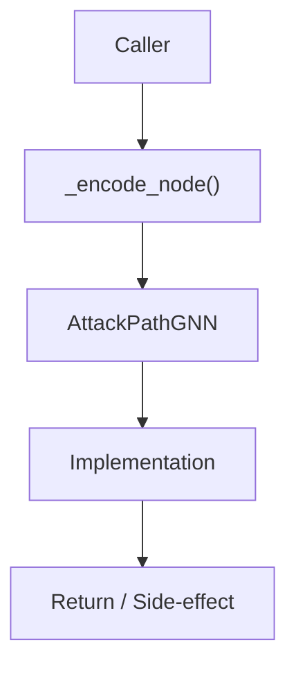

# Community 677 PRD — GNN / Node Feature Engineering

## Master Goal Mapping
- **ALDECI Domain**: GNN / Node Feature Engineering
- **Module**: `AttackPathGNN`
- **Source**: `suite-core/core/ml/attack_path_gnn.py:L825`
- **Function/Method**: `_encode_node`
- **Persona Alignment**: Security Engineer, Platform Operator
- **Strategic Goal**: Provide reliable, well-defined contract for `_encode_node` within the GNN / Node Feature Engineering subsystem

## Architecture Diagram



## Code Proof

**File**: `suite-core/core/ml/attack_path_gnn.py` — **Line**: `L825`

**Signature**: `staticmethod def _encode_node(node: Dict) -> np.ndarray`

```python
"""Encode a node dict into a NODE_FEATURE_DIM-dimensional vector.
Features include: asset_type, criticality, exposure, os_type, open_ports, ...
"""
```

## Inter-Dependencies

- `NODE_FEATURE_DIM constant`
- `AttackPathGNN.build_graph()`
- `_ASSET_TYPE_MAP`

## Data Flow

node dict → one-hot + numeric encoding → np.ndarray shape [NODE_FEATURE_DIM]

## Referenced Docs

- `docs/ALDECI_REARCHITECTURE_v2.md` — Architecture source of truth
- `suite-core/core/ml/attack_path_gnn.py` — Full module implementation

## Acceptance Criteria

- [ ] Output shape equals NODE_FEATURE_DIM
- [ ] Handles unknown asset types gracefully
- [ ] Normalizes numeric features to [0,1]
- [ ] Deterministic for same input

## Effort Estimate

**S**

## Status

**Implemented**
