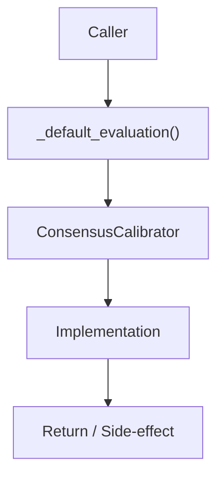

# Community 678 PRD — ML Consensus / Calibration Fallback

## Master Goal Mapping
- **ALDECI Domain**: ML Consensus / Calibration Fallback
- **Module**: `ConsensusCalibrator`
- **Source**: `suite-core/core/ml/consensus_calibrator.py:L511`
- **Function/Method**: `_default_evaluation`
- **Persona Alignment**: Security Engineer, Platform Operator
- **Strategic Goal**: Provide reliable, well-defined contract for `_default_evaluation` within the ML Consensus / Calibration Fallback subsystem

## Architecture Diagram



## Code Proof

**File**: `suite-core/core/ml/consensus_calibrator.py` — **Line**: `L511`

**Signature**: `staticmethod def _default_evaluation(model_id: str) -> ModelEvaluation`

```python
"""Return default evaluation based on prior knowledge of model characteristics."""
```

## Inter-Dependencies

- `_MODEL_DEFAULTS dict`
- `ConsensusCalibrator.evaluate()`
- `karpathy_consensus.py`

## Data Flow

model_id → static defaults lookup → ModelEvaluation(accuracy, reliability, bias_score)

## Referenced Docs

- `docs/ALDECI_REARCHITECTURE_v2.md` — Architecture source of truth
- `suite-core/core/ml/consensus_calibrator.py` — Full module implementation

## Acceptance Criteria

- [ ] Returns non-null ModelEvaluation for any model_id
- [ ] Uses known-good defaults per model type
- [ ] Fallback used when calibration data insufficient

## Effort Estimate

**XS**

## Status

**Implemented**
