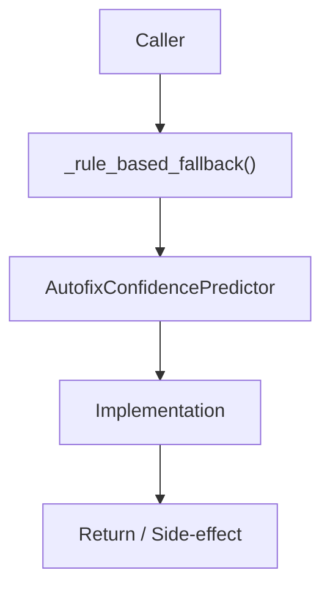

# Community 679 PRD — ML / Autofix Confidence Fallback

## Master Goal Mapping
- **ALDECI Domain**: ML / Autofix Confidence Fallback
- **Module**: `AutofixConfidencePredictor`
- **Source**: `suite-core/core/ml/autofix_confidence.py:L632`
- **Function/Method**: `_rule_based_fallback`
- **Persona Alignment**: Security Engineer, Platform Operator
- **Strategic Goal**: Provide reliable, well-defined contract for `_rule_based_fallback` within the ML / Autofix Confidence Fallback subsystem

## Architecture Diagram



## Code Proof

**File**: `suite-core/core/ml/autofix_confidence.py` — **Line**: `L632`

**Signature**: `staticmethod def _rule_based_fallback(finding: Dict) -> ConfidencePrediction`

```python
"""Rule-based fallback when ML model is unavailable."""
```

## Inter-Dependencies

- `ConfidencePrediction dataclass`
- `AutofixConfidencePredictor.predict()`
- `devsecops_engine.py`

## Data Flow

finding dict → severity/type rule matching → ConfidencePrediction(score, rationale)

## Referenced Docs

- `docs/ALDECI_REARCHITECTURE_v2.md` — Architecture source of truth
- `suite-core/core/ml/autofix_confidence.py` — Full module implementation

## Acceptance Criteria

- [ ] Returns ConfidencePrediction for any finding
- [ ] Higher confidence for well-understood vuln types
- [ ] Lower confidence for novel/complex findings
- [ ] No external dependencies

## Effort Estimate

**S**

## Status

**Implemented**
