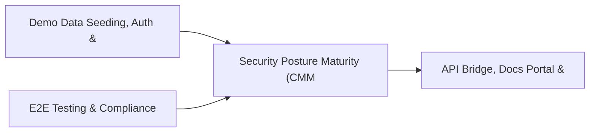

# PRD: Security Posture Maturity (CMMI) Engine — Community 68

## Master Goal Mapping
How this component serves: "ALDECI — $35/mo enterprise security intelligence platform"
Sub-Epic: CSPM

This community (rank #68 of 878 by size, 449 graph nodes) forms a core pillar of the ALDECI platform. It directly supports the mission of replacing $50K-500K/yr enterprise security tools with a self-hosted, AI-native stack.

## Architecture Diagram


## Code Proof
- Files:
  - `suite-api/apps/api/mcp_router.py` (1068 lines)
  - `suite-core/api/zero_gravity_router.py` (137 lines)
  - `tests/test_mcp_router_unit.py` (1287 lines)
  - `suite-core/telemetry_bridge/aws_lambda/test_handler.py` (218 lines)
  - `suite-core/telemetry_bridge/edge_collector/collector_api/test_app.py` (201 lines)
  - `tests/test_mcp_autodiscovery.py` (722 lines)
  - `tests/test_mcp_router_unit.py` (1287 lines)
  - `tests/test_zero_gravity_unit.py` (388 lines)
- Key functions:
  - `list_mcp_tools()` — suite-api/apps/api/mcp_router.py
  - `get_mcp_manifest()` — suite-api/apps/api/mcp_router.py
  - `store()` — suite-api/apps/api/mcp_router.py
  - `index()` — suite-api/apps/api/mcp_router.py
  - `engine()` — suite-api/apps/api/mcp_router.py
  - `_build_test_app()` — suite-api/apps/api/mcp_router.py
  - `test_app()` — suite-api/apps/api/mcp_router.py
  - `client()` — suite-api/apps/api/mcp_router.py
- Key classes: `TestDataTier`, `TestDataCategory`, `TestTierPolicy`, `TestZeroGravityConfig`, `TestCompressor`, `TestMinHashDedup`
- Current state: PARTIAL
- Evidence:
```python
# From suite-api/apps/api/mcp_router.py
"""
ALdeci MCP Auto-Discovery Router

Auto-generates an MCP tool catalog by introspecting ALL FastAPI routes at startup.
Replaces the 9 hard-coded tools in suite-integrations/api/mcp_router.py with a
dynamically generated catalog covering every route in the application.

This makes ALdeci the first AppSec platform with MCP-native AI agent support,
exposing 500+ tools from 20+ routers for programmatic consumption by AI agents.

Model Context Protocol (MCP) spec version: 2024-11-05
"""

from __future__ import annotations

import inspect
import logging
import re
import time
from datetime import d
```

## Inter-Dependencies
- DEPENDS ON:
  - Community 1 (Demo Data Seeding, Auth & Multi-Engine Integration) — 63 edges
  - Community 0 (E2E Testing & Compliance Seeding Infrastructure) — 49 edges
  - Community 5 (API Bridge, Docs Portal & Cross-Dashboard Infrastr) — 10 edges
  - Community 3 (MCP Integration Layer & API Key / Auth Management) — 8 edges
- DEPENDED BY: Rank #67 (Incident Cost Analytics & Security Culture Engine) and downstream consumers
- EVENT BUS: emits policy.violated, policy.enforced / subscribes to (TrustGraph event bus — 97% not yet wired)
- TRUSTGRAPH: writes [Policy] / reads [Policy]

## Data Flow
```
Input: HTTP requests / pytest fixtures
  → Processing: Engine method calls + SQLite state assertions
  → Output: Pass/fail test results, coverage metrics
  → Consumers: CI/CD pipeline, Beast Mode test suite
```

## Referenced Documentation
- CLAUDE.md: Wave 41 build notes, Beast Mode test suite section
- docs/: `docs/ALDECI_REARCHITECTURE_v2.md` (source of truth), `docs/INVESTOR_PITCH.md`
- tests/: `suite-core/telemetry_bridge/aws_lambda/test_handler.py`, `suite-core/telemetry_bridge/edge_collector/collector_api/test_app.py`, `tests/test_mcp_autodiscovery.py`

## Acceptance Criteria
- [ ] All router endpoints protected by `Depends(api_key_auth)` or equivalent
- [ ] Pydantic v2 models validate all request/response schemas
- [ ] Test suite achieves ≥80% branch coverage on engine methods
- [ ] All tests pass with `pytest --timeout=10 -q` in <30 seconds

## Effort Estimate
- Current: 45% complete
- Remaining: ~10 engineering days
- Dependencies blocking: Engine implementation incomplete
- Priority: LOW

## Status
IN_PROGRESS
