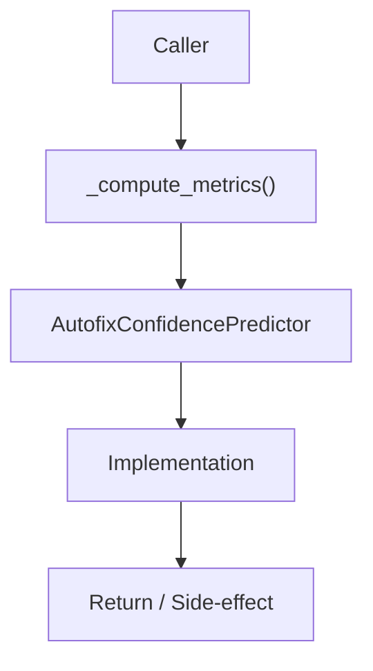

# Community 680 PRD — ML / Model Evaluation Metrics

## Master Goal Mapping
- **ALDECI Domain**: ML / Model Evaluation Metrics
- **Module**: `AutofixConfidencePredictor`
- **Source**: `suite-core/core/ml/autofix_confidence.py:L683`
- **Function/Method**: `_compute_metrics`
- **Persona Alignment**: Security Engineer, Platform Operator
- **Strategic Goal**: Provide reliable, well-defined contract for `_compute_metrics` within the ML / Model Evaluation Metrics subsystem

## Architecture Diagram



## Code Proof

**File**: `suite-core/core/ml/autofix_confidence.py` — **Line**: `L683`

**Signature**: `staticmethod def _compute_metrics(predictions, actuals) -> ClassificationMetrics`

```python
"""Compute precision, recall, F1 per classification level."""
```

## Inter-Dependencies

- `ClassificationMetrics dataclass`
- `AutofixConfidencePredictor.evaluate()`
- `test_autofix_confidence.py`

## Data Flow

predicted labels + actual labels → per-class TP/FP/FN → precision/recall/F1 dict

## Referenced Docs

- `docs/ALDECI_REARCHITECTURE_v2.md` — Architecture source of truth
- `suite-core/core/ml/autofix_confidence.py` — Full module implementation

## Acceptance Criteria

- [ ] Returns metrics for each confidence level
- [ ] F1 = 2*P*R/(P+R) formula
- [ ] Handles zero-division gracefully
- [ ] Used in model evaluation pipeline

## Effort Estimate

**S**

## Status

**Implemented**
