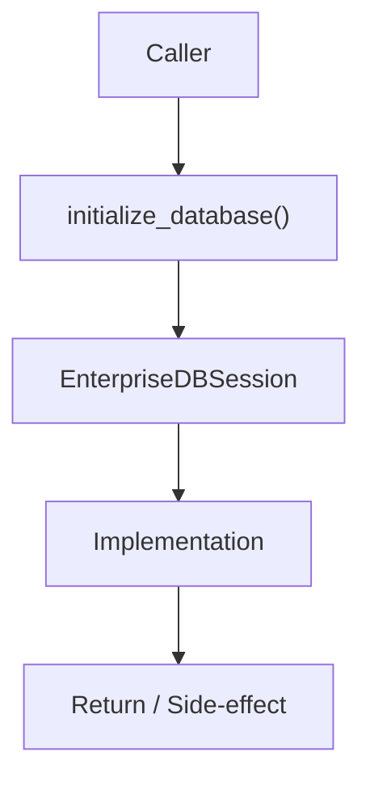

# Community 681 PRD — Enterprise Database / Engine Initialization

## Master Goal Mapping
- **ALDECI Domain**: Enterprise Database / Engine Initialization
- **Module**: `EnterpriseDBSession`
- **Source**: `suite-core/core/db/enterprise/session.py:L26`
- **Function/Method**: `initialize_database`
- **Persona Alignment**: Security Engineer, Platform Operator
- **Strategic Goal**: Provide reliable, well-defined contract for `initialize_database` within the Enterprise Database / Engine Initialization subsystem

## Architecture Diagram



## Code Proof

**File**: `suite-core/core/db/enterprise/session.py` — **Line**: `L26`

**Signature**: `def initialize_database(settings: EnterpriseSettings) -> Engine`

```python
"""Initialize database engine with enterprise configuration"""
```

## Inter-Dependencies

- `EnterpriseSettings`
- `setup_event_handlers (L88)`
- `get_session (L115)`
- `sqlalchemy.create_engine`

## Data Flow

EnterpriseSettings → create_engine with pool_size/timeout/SSL → Engine + event handlers registered

## Referenced Docs

- `docs/ALDECI_REARCHITECTURE_v2.md` — Architecture source of truth
- `suite-core/core/db/enterprise/session.py` — Full module implementation

## Acceptance Criteria

- [ ] Creates engine with configured pool_size
- [ ] Registers event handlers for monitoring
- [ ] Supports SSL for production databases
- [ ] Handles connection timeout settings

## Effort Estimate

**S**

## Status

**Implemented**
