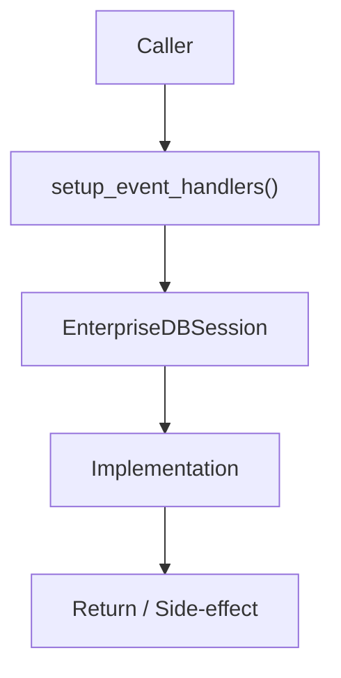

# Community 682 PRD — Enterprise Database / Event Monitoring

## Master Goal Mapping
- **ALDECI Domain**: Enterprise Database / Event Monitoring
- **Module**: `EnterpriseDBSession`
- **Source**: `suite-core/core/db/enterprise/session.py:L88`
- **Function/Method**: `setup_event_handlers`
- **Persona Alignment**: Security Engineer, Platform Operator
- **Strategic Goal**: Provide reliable, well-defined contract for `setup_event_handlers` within the Enterprise Database / Event Monitoring subsystem

## Architecture Diagram



## Code Proof

**File**: `suite-core/core/db/enterprise/session.py` — **Line**: `L88`

**Signature**: `def setup_event_handlers(engine: Engine) -> None`

```python
"""Setup database event handlers for monitoring and optimization"""
```

## Inter-Dependencies

- `sqlalchemy event system`
- `structlog`
- `initialize_database (L26)`

## Data Flow

Engine → register before_cursor_execute/after_cursor_execute events → structured log slow queries

## Referenced Docs

- `docs/ALDECI_REARCHITECTURE_v2.md` — Architecture source of truth
- `suite-core/core/db/enterprise/session.py` — Full module implementation

## Acceptance Criteria

- [ ] Logs queries exceeding slow_query_threshold
- [ ] Tracks query execution time
- [ ] Does not affect query results
- [ ] Events registered once at engine init

## Effort Estimate

**S**

## Status

**Implemented**
