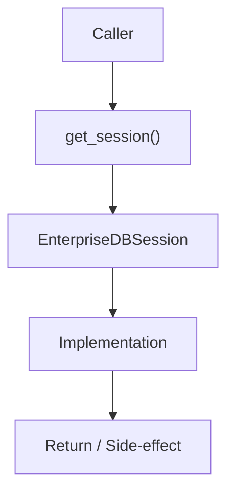

# Community 683 PRD — Enterprise Database / Session Pool

## Master Goal Mapping
- **ALDECI Domain**: Enterprise Database / Session Pool
- **Module**: `EnterpriseDBSession`
- **Source**: `suite-core/core/db/enterprise/session.py:L115`
- **Function/Method**: `get_session`
- **Persona Alignment**: Security Engineer, Platform Operator
- **Strategic Goal**: Provide reliable, well-defined contract for `get_session` within the Enterprise Database / Session Pool subsystem

## Architecture Diagram



## Code Proof

**File**: `suite-core/core/db/enterprise/session.py` — **Line**: `L115`

**Signature**: `def get_session() -> Session`

```python
"""Get database session from pool"""
```

## Inter-Dependencies

- `SessionFactory`
- `get_db_session (L124)`
- `all engine CRUD operations`

## Data Flow

pool → checkout session → Session object for DB operations

## Referenced Docs

- `docs/ALDECI_REARCHITECTURE_v2.md` — Architecture source of truth
- `suite-core/core/db/enterprise/session.py` — Full module implementation

## Acceptance Criteria

- [ ] Returns active Session from pool
- [ ] Session bound to engine
- [ ] Caller responsible for close/commit

## Effort Estimate

**XS**

## Status

**Implemented**
