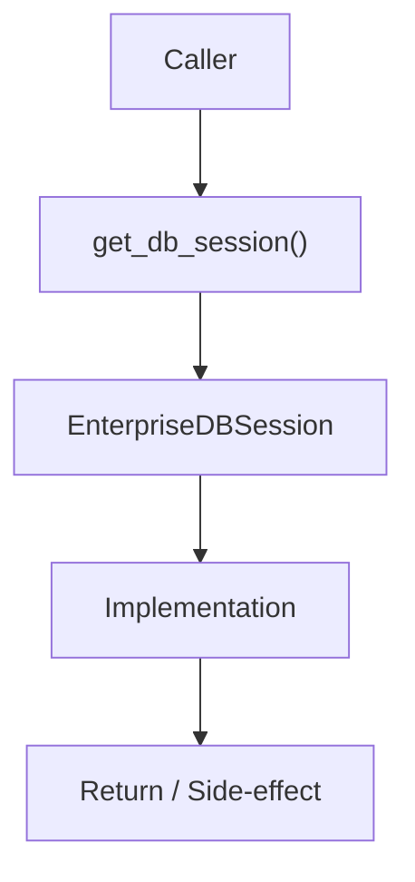

# Community 684 PRD — Enterprise Database / Session Context Manager

## Master Goal Mapping
- **ALDECI Domain**: Enterprise Database / Session Context Manager
- **Module**: `EnterpriseDBSession`
- **Source**: `suite-core/core/db/enterprise/session.py:L124`
- **Function/Method**: `get_db_session`
- **Persona Alignment**: Security Engineer, Platform Operator
- **Strategic Goal**: Provide reliable, well-defined contract for `get_db_session` within the Enterprise Database / Session Context Manager subsystem

## Architecture Diagram



## Code Proof

**File**: `suite-core/core/db/enterprise/session.py` — **Line**: `L124`

**Signature**: `contextmanager def get_db_session() -> Generator[Session, None, None]`

```python
"""Get database session with automatic cleanup"""
```

## Inter-Dependencies

- `get_session (L115)`
- `FastAPI Depends() injection`

## Data Flow

yield Session → auto-close on context exit (commit or rollback on exception)

## Referenced Docs

- `docs/ALDECI_REARCHITECTURE_v2.md` — Architecture source of truth
- `suite-core/core/db/enterprise/session.py` — Full module implementation

## Acceptance Criteria

- [ ] Session closed on context exit
- [ ] Rollback on exception
- [ ] Used via FastAPI Depends()
- [ ] Prevents connection leaks

## Effort Estimate

**XS**

## Status

**Implemented**
