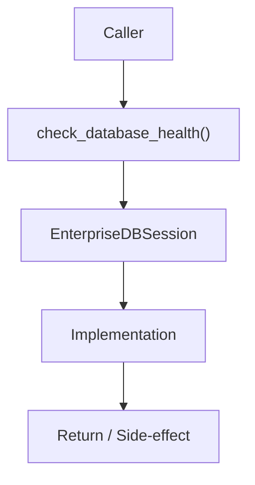

# Community 685 PRD — Enterprise Database / Health Check

## Master Goal Mapping
- **ALDECI Domain**: Enterprise Database / Health Check
- **Module**: `EnterpriseDBSession`
- **Source**: `suite-core/core/db/enterprise/session.py:L137`
- **Function/Method**: `check_database_health`
- **Persona Alignment**: Security Engineer, Platform Operator
- **Strategic Goal**: Provide reliable, well-defined contract for `check_database_health` within the Enterprise Database / Health Check subsystem

## Architecture Diagram



## Code Proof

**File**: `suite-core/core/db/enterprise/session.py` — **Line**: `L137`

**Signature**: `async def check_database_health() -> Dict[str, Any]`

```python
"""Health check for database connectivity"""
```

## Inter-Dependencies

- `get_session`
- `system_health_aggregator.py`
- `/api/v1/health endpoint`

## Data Flow

execute SELECT 1 → check pool stats → Dict{status, pool_size, checked_out, latency_ms}

## Referenced Docs

- `docs/ALDECI_REARCHITECTURE_v2.md` — Architecture source of truth
- `suite-core/core/db/enterprise/session.py` — Full module implementation

## Acceptance Criteria

- [ ] Returns status='healthy' on success
- [ ] Returns status='degraded' on slow response
- [ ] Returns status='unavailable' on connection failure
- [ ] Includes pool utilization stats

## Effort Estimate

**XS**

## Status

**Implemented**
