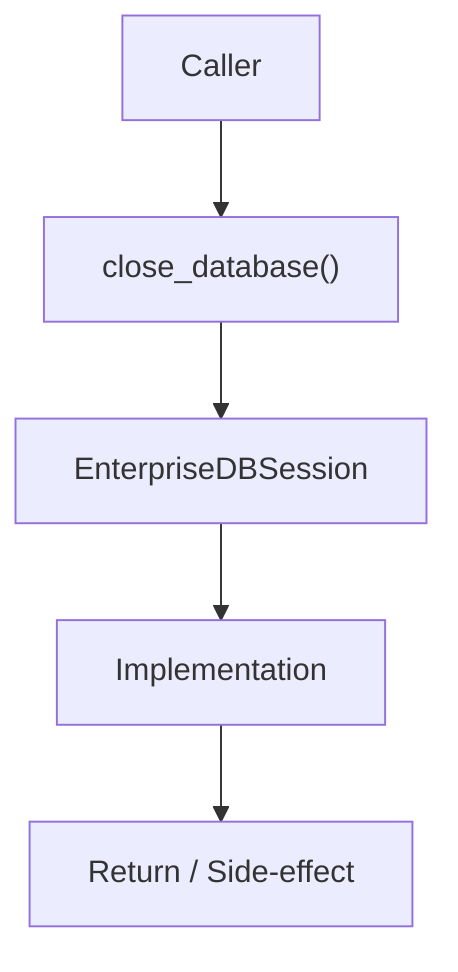

# Community 686 PRD — Enterprise Database / Graceful Shutdown

## Master Goal Mapping
- **ALDECI Domain**: Enterprise Database / Graceful Shutdown
- **Module**: `EnterpriseDBSession`
- **Source**: `suite-core/core/db/enterprise/session.py:L151`
- **Function/Method**: `close_database`
- **Persona Alignment**: Security Engineer, Platform Operator
- **Strategic Goal**: Provide reliable, well-defined contract for `close_database` within the Enterprise Database / Graceful Shutdown subsystem

## Architecture Diagram



## Code Proof

**File**: `suite-core/core/db/enterprise/session.py` — **Line**: `L151`

**Signature**: `async def close_database() -> None`

```python
"""Close database engine and cleanup connections"""
```

## Inter-Dependencies

- `Engine.dispose()`
- `FastAPI shutdown event`
- `initialize_database`

## Data Flow

app shutdown → engine.dispose() → all pooled connections closed

## Referenced Docs

- `docs/ALDECI_REARCHITECTURE_v2.md` — Architecture source of truth
- `suite-core/core/db/enterprise/session.py` — Full module implementation

## Acceptance Criteria

- [ ] Disposes engine pool on call
- [ ] Called during FastAPI shutdown lifespan
- [ ] Prevents connection leaks on restart

## Effort Estimate

**XS**

## Status

**Implemented**
