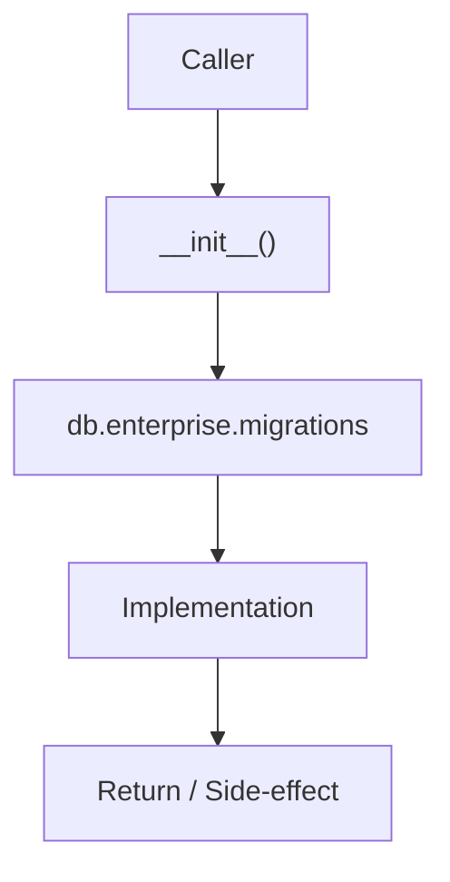

# Community 687 PRD — Enterprise Database / Migrations Package

## Master Goal Mapping
- **ALDECI Domain**: Enterprise Database / Migrations Package
- **Module**: `db.enterprise.migrations`
- **Source**: `suite-core/core/db/enterprise/migrations/__init__.py:L1`
- **Function/Method**: `__init__`
- **Persona Alignment**: Security Engineer, Platform Operator
- **Strategic Goal**: Provide reliable, well-defined contract for `__init__` within the Enterprise Database / Migrations Package subsystem

## Architecture Diagram



## Code Proof

**File**: `suite-core/core/db/enterprise/migrations/__init__.py` — **Line**: `L1`

**Signature**: `module __init__.py`

```python
# migrations package init
```

## Inter-Dependencies

- `Alembic env.py`
- `suite-core/core/db/enterprise/session.py`

## Data Flow

Python import system → package discovery → migration scripts loadable

## Referenced Docs

- `docs/ALDECI_REARCHITECTURE_v2.md` — Architecture source of truth
- `suite-core/core/db/enterprise/migrations/__init__.py` — Full module implementation

## Acceptance Criteria

- [ ] Package importable without error
- [ ] Enables alembic upgrade/downgrade commands
- [ ] No circular imports

## Effort Estimate

**XS (empty init)**

## Status

**Implemented**
