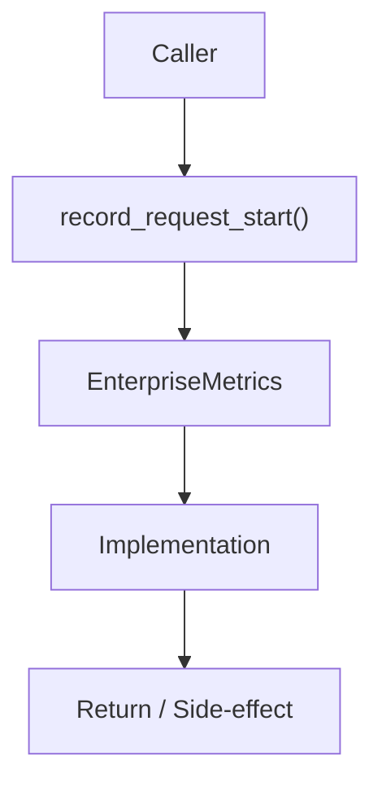

# Community 688 PRD — Observability / Request Lifecycle Tracking

## Master Goal Mapping
- **ALDECI Domain**: Observability / Request Lifecycle Tracking
- **Module**: `EnterpriseMetrics`
- **Source**: `suite-core/core/services/enterprise/metrics.py:L159`
- **Function/Method**: `record_request_start`
- **Persona Alignment**: Security Engineer, Platform Operator
- **Strategic Goal**: Provide reliable, well-defined contract for `record_request_start` within the Observability / Request Lifecycle Tracking subsystem

## Architecture Diagram



## Code Proof

**File**: `suite-core/core/services/enterprise/metrics.py` — **Line**: `L159`

**Signature**: `def record_request_start(method: str, path: str) -> None`

```python
"""Record that a request started so gauges reflect in-flight work."""
```

## Inter-Dependencies

- `_in_flight_gauge`
- `record_request_end (L173)`
- `record_request_metrics (L191)`

## Data Flow

method + path → increment in-flight counter → gauge updated

## Referenced Docs

- `docs/ALDECI_REARCHITECTURE_v2.md` — Architecture source of truth
- `suite-core/core/services/enterprise/metrics.py` — Full module implementation

## Acceptance Criteria

- [ ] Increments in-flight counter
- [ ] Keyed by method+path
- [ ] Called at request ingress middleware

## Effort Estimate

**XS**

## Status

**Implemented**
