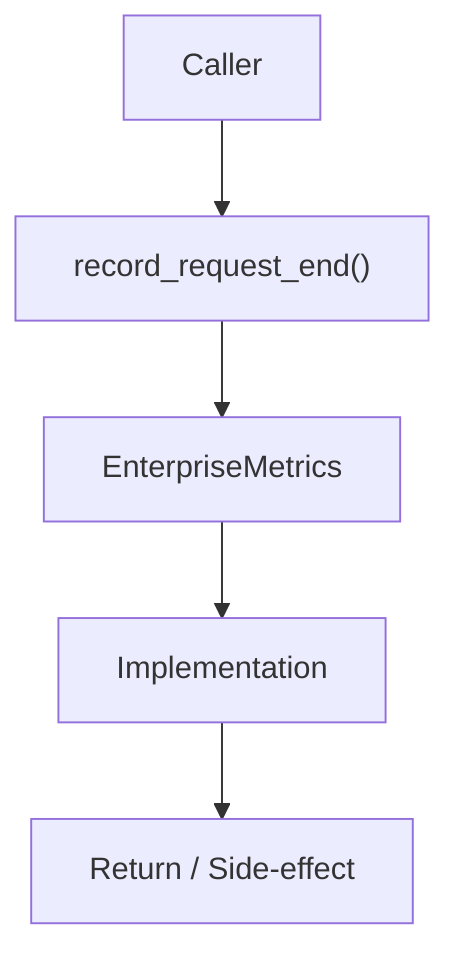

# Community 689 PRD — Observability / Request Lifecycle Tracking

## Master Goal Mapping
- **ALDECI Domain**: Observability / Request Lifecycle Tracking
- **Module**: `EnterpriseMetrics`
- **Source**: `suite-core/core/services/enterprise/metrics.py:L173`
- **Function/Method**: `record_request_end`
- **Persona Alignment**: Security Engineer, Platform Operator
- **Strategic Goal**: Provide reliable, well-defined contract for `record_request_end` within the Observability / Request Lifecycle Tracking subsystem

## Architecture Diagram



## Code Proof

**File**: `suite-core/core/services/enterprise/metrics.py` — **Line**: `L173`

**Signature**: `def record_request_end(method: str, path: str) -> None`

```python
"""Mark the request as finished for in-flight accounting."""
```

## Inter-Dependencies

- `_in_flight_gauge`
- `record_request_start (L159)`

## Data Flow

method + path → decrement in-flight counter → gauge updated (max(0, n-1))

## Referenced Docs

- `docs/ALDECI_REARCHITECTURE_v2.md` — Architecture source of truth
- `suite-core/core/services/enterprise/metrics.py` — Full module implementation

## Acceptance Criteria

- [ ] Decrements in-flight counter
- [ ] Never goes below 0
- [ ] Called in response middleware after handler

## Effort Estimate

**XS**

## Status

**Implemented**
