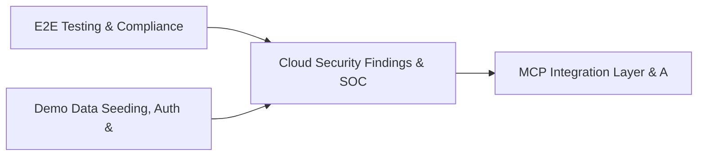

# PRD: Cloud Security Findings & SOC Operations Metrics — Community 69

## Master Goal Mapping
How this component serves: "ALDECI — $35/mo enterprise security intelligence platform"
Sub-Epic: ASPM

This community (rank #69 of 878 by size, 418 graph nodes) forms a core pillar of the ALDECI platform. It directly supports the mission of replacing $50K-500K/yr enterprise security tools with a self-hosted, AI-native stack.

## Architecture Diagram


## Code Proof
- Files:
  - `suite-core/core/patch_management_engine.py` (436 lines)
  - `suite-core/core/security_chaos_engine.py` (480 lines)
  - `tests/test_fail_engine_unit.py` (733 lines)
  - `tests/test_patch_automation_engine.py` (398 lines)
  - `tests/test_patch_management_engine.py` (311 lines)
  - `tests/test_security_chaos_engine.py` (379 lines)
  - `suite-api/apps/api/compliance_planner_router.py` (190 lines)
  - `suite-api/apps/api/patch_automation_router.py` (263 lines)
  - `suite-api/apps/api/patch_management_router.py` (156 lines)
  - `suite-api/apps/api/patch_prioritizer_router.py` (164 lines)
  - `suite-api/apps/api/security_chaos_router.py` (213 lines)
  - `tests/test_compliance_planner.py` (384 lines)
- Key functions:
  - `planner()` — suite-core/core/patch_management_engine.py
  - `soc2_plan()` — suite-core/core/patch_management_engine.py
  - `test_generate_plan_for_each_framework()` — suite-core/core/patch_management_engine.py
  - `test_update_status_all_transitions()` — suite-core/core/patch_management_engine.py
  - `_exp()` — suite-core/core/patch_management_engine.py
  - `test_create_experiment_basic()` — suite-core/core/patch_management_engine.py
  - `test_create_experiment_all_types()` — suite-core/core/patch_management_engine.py
  - `test_create_experiment_invalid_type()` — suite-core/core/patch_management_engine.py
- Key classes: `TestEnums`, `TestPlanGeneration`, `TestPlanRetrieval`, `TestStatusUpdates`, `TestAssignment`, `TestEffortSummary`
- Current state: REAL_LOGIC
- Evidence:
```python
# From suite-core/core/patch_management_engine.py
"""Patch Management Engine — ALDECI.

Tracks patches across their full lifecycle from availability through deployment,
including per-asset deployment records, approval workflow, and statistics.

Capabilities:
  - Patch registry: security, feature, hotfix, rollup, service_pack, firmware
  - Status lifecycle: available → testing → approved → deploying → deployed / failed / rollback
  - Per-asset deployment records with success/failure counters
  - Stats: critical undeployed, deployment success rate, patches needing attention

Compliance: NIST SP 800-40 (Guide to Enterprise Patch Management), CIS
```

## Inter-Dependencies
- DEPENDS ON:
  - Community 0 (E2E Testing & Compliance Seeding Infrastructure) — 76 edges
  - Community 1 (Demo Data Seeding, Auth & Multi-Engine Integration) — 20 edges
  - Community 3 (MCP Integration Layer & API Key / Auth Management) — 6 edges
  - Community 28 (Security Posture Benchmarking & Maturity Engine) — 5 edges
- DEPENDED BY: Rank #68 (Security Posture Maturity (CMMI) Engine) and downstream consumers
- EVENT BUS: emits compliance.status_changed / subscribes to (TrustGraph event bus — 97% not yet wired)
- TRUSTGRAPH: writes [ComplianceControl] / reads [ComplianceControl]

## Data Flow
```
Input: HTTP requests / pytest fixtures
  → Processing: Engine method calls + SQLite state assertions
  → Output: Pass/fail test results, coverage metrics
  → Consumers: CI/CD pipeline, Beast Mode test suite
```

## Referenced Documentation
- CLAUDE.md: Wave 41 build notes, Beast Mode test suite section
- docs/: `docs/ALDECI_REARCHITECTURE_v2.md` (source of truth), `docs/INVESTOR_PITCH.md`
- tests/: `tests/test_compliance_planner.py`, `tests/test_fail_engine_unit.py`, `tests/test_patch_automation_engine.py`

## Acceptance Criteria
- [ ] All engine CRUD operations enforce org_id isolation (no cross-tenant data leakage)
- [ ] SQLite opened with WAL mode + threading.RLock on all write paths
- [ ] All endpoints return within 200ms at p95 under 100 rps load
- [ ] All router endpoints protected by `Depends(api_key_auth)` or equivalent
- [ ] Pydantic v2 models validate all request/response schemas
- [ ] Test suite achieves ≥80% branch coverage on engine methods

## Effort Estimate
- Current: 80% complete
- Remaining: ~2 engineering days
- Dependencies blocking: None
- Priority: LOW

## Status
IN_PROGRESS
