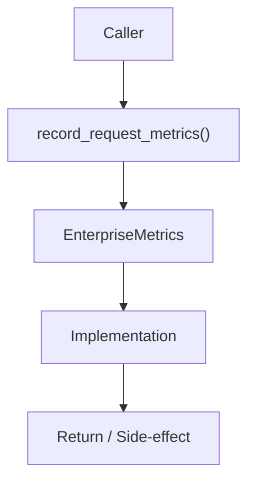

# Community 690 PRD — Observability / HTTP Metrics Collection

## Master Goal Mapping
- **ALDECI Domain**: Observability / HTTP Metrics Collection
- **Module**: `EnterpriseMetrics`
- **Source**: `suite-core/core/services/enterprise/metrics.py:L191`
- **Function/Method**: `record_request_metrics`
- **Persona Alignment**: Security Engineer, Platform Operator
- **Strategic Goal**: Provide reliable, well-defined contract for `record_request_metrics` within the Observability / HTTP Metrics Collection subsystem

## Architecture Diagram



## Code Proof

**File**: `suite-core/core/services/enterprise/metrics.py` — **Line**: `L191`

**Signature**: `def record_request_metrics(method, path, status_code, duration_ms) -> None`

```python
"""Capture counters, ratios, and hot-path gauges for an HTTP request."""
```

## Inter-Dependencies

- `_request_counter`
- `_error_counter`
- `_latency_histogram`
- `Prometheus/StatsD exporters`

## Data Flow

method+path+status+duration → update counters + histogram buckets → Prometheus/StatsD

## Referenced Docs

- `docs/ALDECI_REARCHITECTURE_v2.md` — Architecture source of truth
- `suite-core/core/services/enterprise/metrics.py` — Full module implementation

## Acceptance Criteria

- [ ] Increments total request counter
- [ ] Increments error counter for 4xx/5xx
- [ ] Updates latency histogram
- [ ] Labels by method, path, status_code

## Effort Estimate

**S**

## Status

**Implemented**
