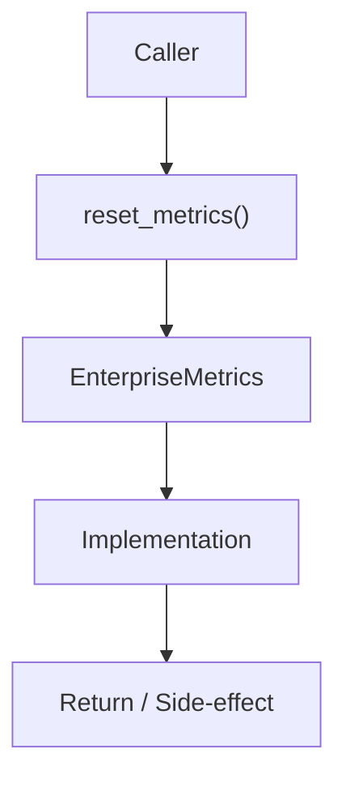

# Community 691 PRD — Observability / Test Isolation

## Master Goal Mapping
- **ALDECI Domain**: Observability / Test Isolation
- **Module**: `EnterpriseMetrics`
- **Source**: `suite-core/core/services/enterprise/metrics.py:L247`
- **Function/Method**: `reset_metrics`
- **Persona Alignment**: Security Engineer, Platform Operator
- **Strategic Goal**: Provide reliable, well-defined contract for `reset_metrics` within the Observability / Test Isolation subsystem

## Architecture Diagram



## Code Proof

**File**: `suite-core/core/services/enterprise/metrics.py` — **Line**: `L247`

**Signature**: `def reset_metrics() -> None`

```python
"""Reset derived runtime metrics so tests can assert fresh state."""
```

## Inter-Dependencies

- `_request_counter`
- `_error_counter`
- `_latency_histogram`
- `_in_flight_gauge`

## Data Flow

no input → zero all metric accumulators → clean slate for test assertions

## Referenced Docs

- `docs/ALDECI_REARCHITECTURE_v2.md` — Architecture source of truth
- `suite-core/core/services/enterprise/metrics.py` — Full module implementation

## Acceptance Criteria

- [ ] Zeroes all counters and gauges
- [ ] Clears histogram buckets
- [ ] Called in test setUp/teardown
- [ ] Has no effect on Prometheus registry

## Effort Estimate

**XS**

## Status

**Implemented**
