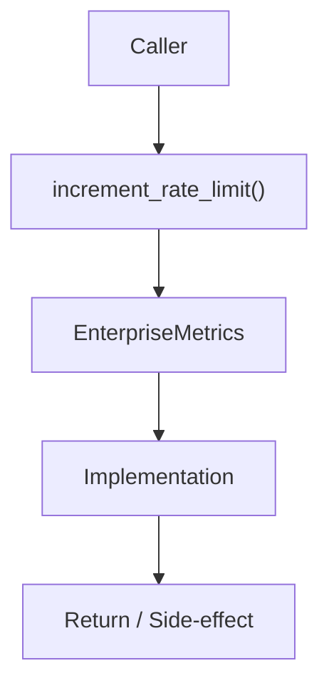

# Community 692 PRD — Observability / Rate Limiting Metrics

## Master Goal Mapping
- **ALDECI Domain**: Observability / Rate Limiting Metrics
- **Module**: `EnterpriseMetrics`
- **Source**: `suite-core/core/services/enterprise/metrics.py:L261`
- **Function/Method**: `increment_rate_limit`
- **Persona Alignment**: Security Engineer, Platform Operator
- **Strategic Goal**: Provide reliable, well-defined contract for `increment_rate_limit` within the Observability / Rate Limiting Metrics subsystem

## Architecture Diagram



## Code Proof

**File**: `suite-core/core/services/enterprise/metrics.py` — **Line**: `L261`

**Signature**: `def increment_rate_limit(org_id: str, endpoint: str) -> None`

```python
"""Increment the rate limiting counter, ignoring instrumentation failures."""
```

## Inter-Dependencies

- `_rate_limit_counter`
- `rate_limiting middleware`
- `Redis rate limiter`

## Data Flow

org_id + endpoint → try increment counter → silent except on failure

## Referenced Docs

- `docs/ALDECI_REARCHITECTURE_v2.md` — Architecture source of truth
- `suite-core/core/services/enterprise/metrics.py` — Full module implementation

## Acceptance Criteria

- [ ] Increments rate_limit_counter by org_id+endpoint
- [ ] Never raises exceptions (fire-and-forget)
- [ ] Used to track rate limit hits per org

## Effort Estimate

**XS**

## Status

**Implemented**
