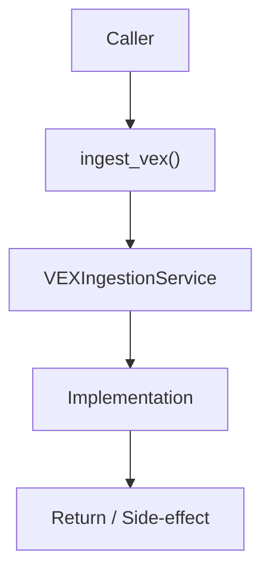

# Community 693 PRD — VEX / Vulnerability Exploitability Exchange

## Master Goal Mapping
- **ALDECI Domain**: VEX / Vulnerability Exploitability Exchange
- **Module**: `VEXIngestionService`
- **Source**: `suite-core/core/services/enterprise/vex_ingestion.py:L71`
- **Function/Method**: `ingest_vex`
- **Persona Alignment**: Security Engineer, Platform Operator
- **Strategic Goal**: Provide reliable, well-defined contract for `ingest_vex` within the VEX / Vulnerability Exploitability Exchange subsystem

## Architecture Diagram



## Code Proof

**File**: `suite-core/core/services/enterprise/vex_ingestion.py` — **Line**: `L71`

**Signature**: `def ingest_vex(document: Dict) -> int`

```python
"""Parse a VEX document and persist the resulting assertions.
The method is idempotent — re-ingesting the same document updates existing assertions.
"""
```

## Inter-Dependencies

- `VEXAssertion model`
- `get_assertions_for_cve (L95)`
- `apply_vex_suppressions (L136)`
- `sbom_export_engine.py`

## Data Flow

VEX JSON doc → parse assertions per CVE → upsert to DB → return count of persisted assertions

## Referenced Docs

- `docs/ALDECI_REARCHITECTURE_v2.md` — Architecture source of truth
- `suite-core/core/services/enterprise/vex_ingestion.py` — Full module implementation

## Acceptance Criteria

- [ ] Parses CycloneDX VEX and OpenVEX formats
- [ ] Idempotent on re-ingestion
- [ ] Returns count of assertions persisted
- [ ] Handles malformed documents with logged error

## Effort Estimate

**M**

## Status

**Implemented**
