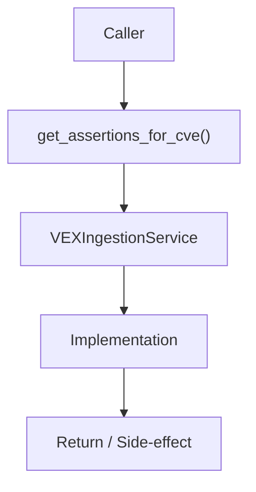

# Community 694 PRD — VEX / Assertion Cache Lookup

## Master Goal Mapping
- **ALDECI Domain**: VEX / Assertion Cache Lookup
- **Module**: `VEXIngestionService`
- **Source**: `suite-core/core/services/enterprise/vex_ingestion.py:L95`
- **Function/Method**: `get_assertions_for_cve`
- **Persona Alignment**: Security Engineer, Platform Operator
- **Strategic Goal**: Provide reliable, well-defined contract for `get_assertions_for_cve` within the VEX / Assertion Cache Lookup subsystem

## Architecture Diagram



## Code Proof

**File**: `suite-core/core/services/enterprise/vex_ingestion.py` — **Line**: `L95`

**Signature**: `def get_assertions_for_cve(cve_id: str) -> Dict[str, VEXAssertion]`

```python
"""Return the cached assertions keyed by CVE identifier."""
```

## Inter-Dependencies

- `_assertions_cache dict`
- `ingest_vex (L71)`
- `apply_vex_suppressions (L136)`

## Data Flow

cve_id → cache lookup → Dict of VEXAssertion objects or empty dict

## Referenced Docs

- `docs/ALDECI_REARCHITECTURE_v2.md` — Architecture source of truth
- `suite-core/core/services/enterprise/vex_ingestion.py` — Full module implementation

## Acceptance Criteria

- [ ] Returns dict keyed by component identifier
- [ ] Returns empty dict for unknown CVE
- [ ] Cache populated by ingest_vex()

## Effort Estimate

**XS**

## Status

**Implemented**
