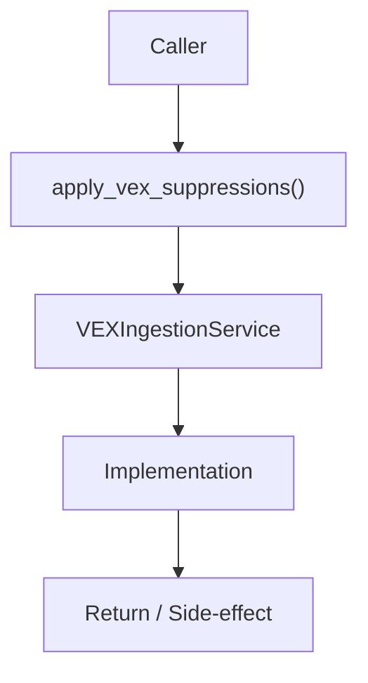

# Community 695 PRD — VEX / Vulnerability Suppression

## Master Goal Mapping
- **ALDECI Domain**: VEX / Vulnerability Suppression
- **Module**: `VEXIngestionService`
- **Source**: `suite-core/core/services/enterprise/vex_ingestion.py:L136`
- **Function/Method**: `apply_vex_suppressions`
- **Persona Alignment**: Security Engineer, Platform Operator
- **Strategic Goal**: Provide reliable, well-defined contract for `apply_vex_suppressions` within the VEX / Vulnerability Suppression subsystem

## Architecture Diagram



## Code Proof

**File**: `suite-core/core/services/enterprise/vex_ingestion.py` — **Line**: `L136`

**Signature**: `def apply_vex_suppressions(findings: List[Dict]) -> List[Dict]`

```python
"""Return findings with VEX suppressions applied.
Findings with `not_affected` status in VEX assertions are excluded from the result.
"""
```

## Inter-Dependencies

- `get_assertions_for_cve (L95)`
- `sbom_export_engine.py`
- `vuln_prioritization_engine.py`

## Data Flow

findings list → check each finding's CVE against VEX assertions → exclude not_affected → filtered list

## Referenced Docs

- `docs/ALDECI_REARCHITECTURE_v2.md` — Architecture source of truth
- `suite-core/core/services/enterprise/vex_ingestion.py` — Full module implementation

## Acceptance Criteria

- [ ] Removes findings with not_affected VEX status
- [ ] Preserves findings without VEX assertions
- [ ] Does not mutate input list
- [ ] Logs count of suppressed findings

## Effort Estimate

**S**

## Status

**Implemented**
