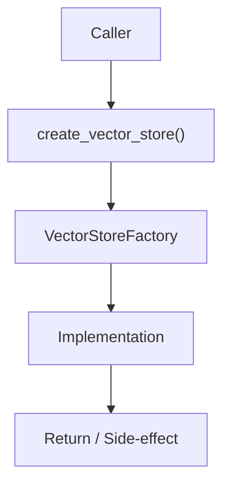

# Community 696 PRD — Vector Store / RAG Infrastructure

## Master Goal Mapping
- **ALDECI Domain**: Vector Store / RAG Infrastructure
- **Module**: `VectorStoreFactory`
- **Source**: `suite-core/core/services/enterprise/vector_store.py:L431`
- **Function/Method**: `create_vector_store`
- **Persona Alignment**: Security Engineer, Platform Operator
- **Strategic Goal**: Provide reliable, well-defined contract for `create_vector_store` within the Vector Store / RAG Infrastructure subsystem

## Architecture Diagram



## Code Proof

**File**: `suite-core/core/services/enterprise/vector_store.py` — **Line**: `L431`

**Signature**: `def create_vector_store(config: VectorStoreConfig) -> BaseVectorStore`

```python
"""Create vector store — ChromaDB if available, in-memory fallback otherwise"""
```

## Inter-Dependencies

- `ChromaVectorStore`
- `InMemoryVectorStore`
- `trustgraph/graph_rag.py`
- `ai_security_advisor_engine.py`

## Data Flow

config → try import chromadb → create ChromaVectorStore or InMemoryVectorStore

## Referenced Docs

- `docs/ALDECI_REARCHITECTURE_v2.md` — Architecture source of truth
- `suite-core/core/services/enterprise/vector_store.py` — Full module implementation

## Acceptance Criteria

- [ ] Returns ChromaDB store when chromadb installed
- [ ] Falls back to InMemory store gracefully
- [ ] Both implementations satisfy BaseVectorStore interface
- [ ] Config passed through to chosen backend

## Effort Estimate

**S**

## Status

**Implemented**
