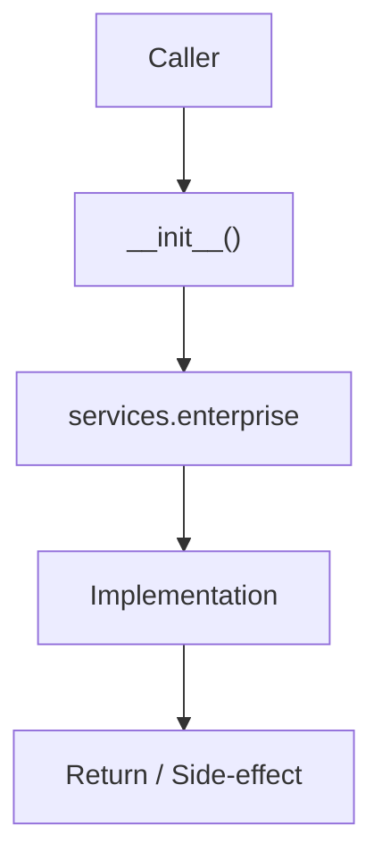

# Community 697 PRD — Enterprise Services Package

## Master Goal Mapping
- **ALDECI Domain**: Enterprise Services Package
- **Module**: `services.enterprise`
- **Source**: `suite-core/core/services/enterprise/__init__.py:L1`
- **Function/Method**: `__init__`
- **Persona Alignment**: Security Engineer, Platform Operator
- **Strategic Goal**: Provide reliable, well-defined contract for `__init__` within the Enterprise Services Package subsystem

## Architecture Diagram



## Code Proof

**File**: `suite-core/core/services/enterprise/__init__.py` — **Line**: `L1`

**Signature**: `module __init__.py`

```python
# enterprise services package
```

## Inter-Dependencies

- `metrics.py`
- `vex_ingestion.py`
- `vector_store.py`
- `cache_service.py`

## Data Flow

Python import → expose service classes at package level

## Referenced Docs

- `docs/ALDECI_REARCHITECTURE_v2.md` — Architecture source of truth
- `suite-core/core/services/enterprise/__init__.py` — Full module implementation

## Acceptance Criteria

- [ ] Package importable without error
- [ ] Key classes exported at package level
- [ ] No circular imports

## Effort Estimate

**XS**

## Status

**Implemented**
