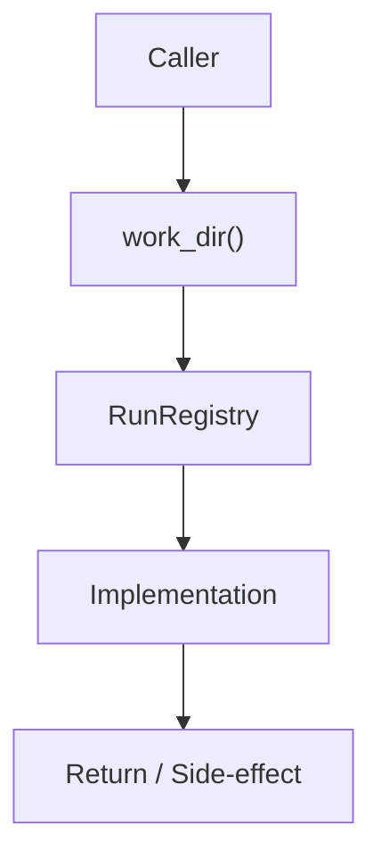

# Community 698 PRD — Pipeline Run Management

## Master Goal Mapping
- **ALDECI Domain**: Pipeline Run Management
- **Module**: `RunRegistry`
- **Source**: `suite-core/core/services/enterprise/run_registry.py:L40`
- **Function/Method**: `work_dir`
- **Persona Alignment**: Security Engineer, Platform Operator
- **Strategic Goal**: Provide reliable, well-defined contract for `work_dir` within the Pipeline Run Management subsystem

## Architecture Diagram



## Code Proof

**File**: `suite-core/core/services/enterprise/run_registry.py` — **Line**: `L40`

**Signature**: `@property def work_dir(self) -> Path`

```python
"""Alias for run_dir — used by StageRunner."""
```

## Inter-Dependencies

- `run_dir property`
- `StageRunner`
- `brain_pipeline.py`

## Data Flow

no input → returns self.run_dir Path object

## Referenced Docs

- `docs/ALDECI_REARCHITECTURE_v2.md` — Architecture source of truth
- `suite-core/core/services/enterprise/run_registry.py` — Full module implementation

## Acceptance Criteria

- [ ] Returns same value as run_dir
- [ ] Used by StageRunner.work_dir references
- [ ] Path exists when run is active

## Effort Estimate

**XS (alias property)**

## Status

**Implemented**
